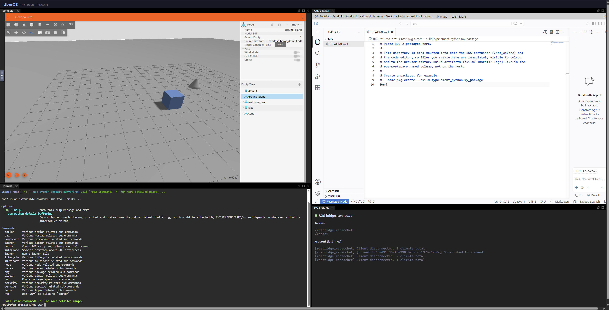

# UbeROS

> A browser-accessible ROS development and simulation environment on Docker Compose.

UbeROS delivers a complete, containerized ROS 2 workspace — physics simulator,
browser code editor, terminals, and a canvas window manager — reachable from a
standard web browser with no local install beyond Docker.



## Quick start

```bash
docker compose up
```

Then open <http://localhost:8080>. The window-manager canvas loads with
Terminal, Code Editor, and ROS Status panels, plus a **Simulators** menu to
launch Gazebo (rendered in the browser via gzweb) or Turtlesim on demand.

To run detached:

```bash
docker compose up -d
```

To stop (volumes are preserved):

```bash
docker compose down
```

> **Warning:** `docker compose down -v` deletes the named volumes, including your
> ROS workspace build artifacts. Use plain `docker compose down` to keep data.

## Services

| Service | Purpose | Internal ports |
|---|---|---|
| `proxy` | Single ingress (Nginx); the only host-published port | 8080 |
| `frontend` | Svelte + Golden Layout window manager | 3000 |
| `ros` | ROS 2 middleware, rosbridge, ttyd terminals, colcon | 9090, 7681 |
| `gazebo` | Headless `gz sim -s` + gz-launch WebsocketServer (scene-state stream) + `ros_gz` bridge | 9002 |
| `gzweb-client` | Self-hosted gzweb web client (Three.js), served at `/gzweb/` | 3000 |
| `turtlesim` | Turtlesim + Xvfb + x11vnc + noVNC (GUI simulator over VNC) | 5900, 6080 |
| `editor` | code-server on the shared ROS workspace | 8443 |
| `control` | Operational control plane (service reset, simulator launch/stop, config) | 9000 |
| `discovery-server` | Fast DDS discovery (removes multicast dependency) | 11811 |

The simulator services (`gazebo`, `gzweb-client`, `turtlesim`) run under the
`simulators` compose profile (see [Simulator selection](#simulator-selection-build-time)).
Only the proxy port is published to the host. Backend ports are reachable only
through the proxy.

## Configuration

Settings live in `.env` (committed defaults contain no secrets):

| Variable | Default | Purpose |
|---|---|---|
| `ROS_DISTRO` | `kilted` | ROS 2 distribution (switch to `jazzy` as fallback) |
| `GZ_RELEASE` | `ionic` | Gazebo release (switch to `harmonic` with Jazzy) |
| `UBEROS_PORT` | `8080` | Host port for the proxy |
| `ROS_DOMAIN_ID` | `42` | DDS domain (cross-platform-safe range) |
| `UBEROS_AUTH` | `off` | Set to `basic` to enable proxy authentication |
| `UBEROS_SERVICES` | `ros,gazebo,editor,frontend` | Services the system menu may reset |
| `NPM_REGISTRY` | public npm | npm registry for image builds; point at a proxy in `.env` |

### Simulators (runtime)

Simulators are launched on demand from the **Simulators** menu and run
concurrently, each as its own container; they survive a browser reload (the
panel reconnects to the still-running simulator). By default both start with the
stack (`COMPOSE_PROFILES=simulators`) and can be stopped/relaunched from the menu.

| Simulator | Visualization | ROS integration |
|---|---|---|
| **Gazebo** | Browser 3D via `gzweb` (headless `gz sim -s` streams scene state over a WebSocket; no VNC) | `ros_gz` bridge, `/clock` bridged by default |
| **Turtlesim** | noVNC (Xvfb + x11vnc GUI window) | Native ROS 2 node (`/turtle1/cmd_vel`, `/turtle1/pose`) |

All simulators join the shared `ROS_DOMAIN_ID` through the Fast DDS discovery
server (no multicast).

### Simulator selection (build-time)

Which simulators build and appear is controlled by two coordinated settings in
`.env` (defaults install and show **both** Gazebo and Turtlesim):

- `COMPOSE_PROFILES` — build-time selection. Each simulator has its own compose
  profile (`sim-gazebo`, `sim-turtlesim`) plus the umbrella `simulators` (all).
  Only a simulator whose profile is active is built and created as a service.
- `UBEROS_SIMULATORS` — registry/menu gating; which entries the menu offers.

Set them in tandem so an excluded simulator drops from both the built services
and the menu:

| Selection | `COMPOSE_PROFILES` | `UBEROS_SIMULATORS` |
|---|---|---|
| Both (default) | `simulators` | *(unset)* |
| Gazebo only | `sim-gazebo` | `gazebo` |
| Turtlesim only | `sim-turtlesim` | `turtlesim` |

Verify a selection with `docker compose config --services`.

### GPU acceleration (opt-in)

NVIDIA (Linux + NVIDIA Container Toolkit):

```bash
docker compose -f compose.yaml -f compose.override.gpu.yaml up
```

Intel iGPU/dGPU (native Linux, `/dev/dri` passthrough — see
[docs/specs/03-intel-openvino-research.md](docs/specs/03-intel-openvino-research.md)):

```bash
docker compose -f compose.yaml -f compose.override.intel.yaml up
```

Windows (Docker Desktop / WSL2) — the GPU is exposed as `/dev/dxg`, not
`/dev/dri`, so use the WSL overlay (vendor-neutral: Intel/AMD/NVIDIA):

```bash
docker compose -f compose.yaml -f compose.override.wsl.yaml up
```

macOS Docker Desktop has no GPU passthrough; the default software-rendering
path is used there. Load only one GPU overlay at a time.

## Development loop

1. Edit a package in the **Code Editor** panel (`workspace/src/`).
2. In a **Terminal** panel: `cd /ros_ws && colcon build --symlink-install`.
3. `source install/setup.bash`, then `ros2 run <pkg> <node>`.
4. Launch a simulator from the **Simulators** menu (Gazebo web view or
   Turtlesim) and observe the result there and in the **ROS Status** panel.

### Terminal copy and paste

The embedded terminal runs `ttyd` + `tmux`, so clipboard behavior follows both browser and tmux rules:

* Select text with left-click drag to copy from the terminal view.
* Right-click pastes the latest tmux buffer into the active shell.
* To paste from your host clipboard, use your browser/terminal shortcut while the terminal iframe is focused (`Ctrl+Shift+V` on most Linux/Windows setups, `Cmd+V` on macOS).

If a browser blocks clipboard access, use the keyboard shortcut again after granting clipboard permissions for the site.

## Security

Authentication is off by default for localhost. Before any non-localhost
exposure, enable it (NFR N-05) — no code edits required:

```bash
htpasswd -c config/nginx/.htpasswd admin
# set UBEROS_AUTH=basic in .env, then recreate the proxy
docker compose up -d --build proxy control
```

With auth enabled the workspace menu shows a **Logout** action that clears the
stored credentials and forces re-authentication.

## Documentation

- Project brief: [docs/specs/01-Init.md](docs/specs/01-Init.md)
- Research report: [docs/specs/01-Init-research.md](docs/specs/01-Init-research.md)
- PRD (init): [docs/prds/uberos-init.md](docs/prds/uberos-init.md)
- Simulation & Visualization: [BRD](docs/brds/uberos-simulation-visualization-brd.md) · [PRD](docs/prds/uberos-simulation-visualization.md)
- Decisions: [docs/decisions/](docs/decisions/)

> **Note:** The primary ROS distribution (Kilted) passed SPIKE-A image and
> package verification. See [ADR-001](docs/decisions/ADR-001-ros-distro.md).
> Current implementation defaults are `ROS_DISTRO=kilted` and
> `GZ_RELEASE=ionic`. If a compatibility rollback is needed, set
> `ROS_DISTRO=jazzy` and `GZ_RELEASE=harmonic`.
