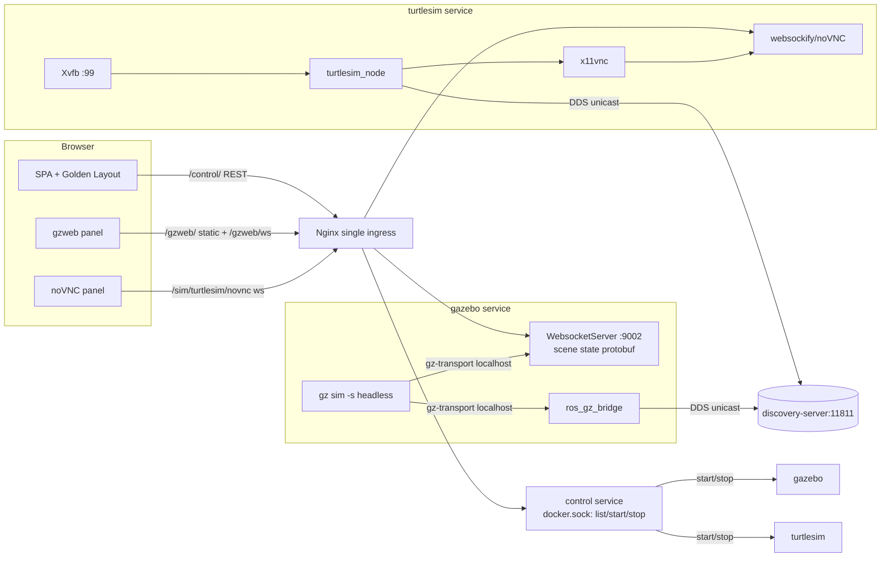

<!-- markdownlint-disable-file -->
<!-- markdown-table-prettify-ignore-start -->
# UbeROS Simulation and Visualization - Product Requirements Document (PRD)
Version 1.0.0 | Status Approved | Owner jmservera | Team Squad | Target Next iteration | Lifecycle Approved

## Progress Tracker
| Phase | Done | Gaps | Updated |
|-------|------|------|---------|
| Context | 90% | Derived from the Simulation & Visualization BRD (all open questions resolved) | 2026-07-21 |
| Problem & Users | 85% | Personas confirmed; educator journey light | 2026-07-21 |
| Scope | 90% | Separate-container, concurrent, persistent, build-selectable confirmed | 2026-07-21 |
| Requirements | 90% | FR/NFR across six themes incl. auto-start (FR-B8) + ros-image cleanup (FR-E6) | 2026-07-21 |
| Metrics & Risks | 90% | gzweb path confirmed for Ionic; client=minimal, pairing kilted/ionic locked | 2026-07-21 |
| Operationalization | 90% | Lifecycle design approved: profile + allowlisted start/stop; configurable auto-start, default both on (planned) | 2026-07-21 |
| Finalization | 100% | Approved 2026-07-21; all questions resolved; ready for implementation | 2026-07-21 |
Unresolved Critical Questions: 0 | TBDs: 0

Current implementation note: this PRD is approved design for a next iteration.
The current stack still runs the legacy `simulator` + `vnc` path with no runtime
simulator launch API or `gzweb` route in production code.

Theme A implementation staging note (branch `sim-theme-a-framework`): the
simulator registry/menu scaffolding lands in Theme A, but `turtlesim` remains
intentionally disabled (`enabled: false`) until its compose service and
`/sim/turtlesim/novnc/` proxy route land in later themes (B/C).

## 1. Executive Summary
### Context
UbeROS is a browser-based ROS 2 development environment: a Golden Layout v2 canvas of dockable
panels (Simulator/noVNC, Terminal, Code Editor, ROS Status) served behind a single Nginx reverse
proxy, launched with `docker compose up`. Today the only simulator is Gazebo: the `simulator`
service runs `gz sim` on an Xvfb `:99` display and a `vnc` sidecar streams that display to the
browser over noVNC. Gazebo is a hard-wired, always-on pixel stream that is neither selectable nor
bridged into the ROS 2 graph, and it renders in software (llvmpipe) on WSL2 Intel. This PRD
implements the [Simulation and Visualization BRD](../brds/uberos-simulation-visualization-brd.md).
### Core Opportunity
Turn simulation from a single baked-in viewer into a **pluggable, build-configurable set of
simulators** that operators launch on demand from a menu, that run **concurrently**, that **survive
a page reload**, and that are **first-class ROS 2 participants**. Move Gazebo off the software-
rendered VNC path onto its **native web visualization (`gzweb`)** so physics compute stays
server-side (GPU-eligible) and rendering happens in the browser, targeting **interaction lag under
300ms** versus the ~1s VNC baseline. Add **Turtlesim** as a second, lightweight visualizer for
teaching and quick tests.
### Goals
| Goal ID | Statement | Type | Baseline | Target | Timeframe | Priority |
|---------|-----------|------|----------|--------|-----------|----------|
| G-001 | Pluggable simulator/visualizer framework (registry + contract) | Capability | One hard-wired Gazebo service | Registry-driven; adding a simulator is additive | This iteration | Must |
| G-002 | Runtime launch menu that starts/stops simulators on demand | Capability | No menu; Gazebo always-on | Menu launches/stops any installed simulator | This iteration | Must |
| G-003 | Turtlesim as a second visualizer over VNC, ROS-visible | Capability | No Turtlesim | Turtlesim launches, renders, appears in ROS graph | This iteration | Must |
| G-004 | Build-time selection of installed simulators (defaults Gazebo + Turtlesim) | Capability | Gazebo only, not selectable | Build-selectable install set with defaults | This iteration | Must |
| G-005 | ROS 2 integration for simulators (Gazebo via `ros_gz`, `/clock` default) | Capability | Gazebo not bridged to ROS 2 | Simulator topics visible in ROS graph | This iteration | Must |
| G-006 | Gazebo native web visualization (`gzweb`), lag < 300ms, VNC retired for Gazebo | Performance | VNC stream, software render, ~1s lag | Web-rendered Gazebo via `gzweb`, < 300ms | This iteration | Must |
| G-007 | Concurrent, session-persistent simulators | Reliability | Single always-on Gazebo tied to the stack | Multiple run at once; survive reload | This iteration | Must |
### Objectives (Optional)
| Objective | Key Result | Priority | Owner |
|-----------|------------|----------|-------|
| Make simulation pluggable | Adding a simulator = registry entry + compose service, no core UI edits | Must | Squad |
| Make Gazebo fast and ROS-native | `gzweb` web render < 300ms and `/clock` bridged on launch | Must | Squad |

## 2. Problem Definition
### Current Situation
The `simulator` service always runs Gazebo on Xvfb `:99`; the `vnc` sidecar (openbox + x11vnc +
websockify) shares the simulator network namespace and streams `:99` to `/novnc/`. There is no way
to choose a simulator, add another, run two at once, or launch/stop on demand — and closing the
browser tab does not stop the sim, but there is no menu to manage it either. Gazebo is not bridged
to ROS 2 (`gz sim` speaks gz-transport, not DDS), so `ros2 topic list` shows nothing from the sim.
On WSL2 Intel the VNC path renders in software (~1s interaction lag, per the Enhancements BRD Theme
E spike).
### Problem Statement
Operators can run only one hard-wired simulator, cannot select/add/launch simulators, get Gazebo
as a slow non-ROS pixel stream, and have no lightweight visualizer for teaching.
### Root Causes
* Simulation is modeled as one fixed service + VNC sidecar rather than a registry of launchable simulators.
* `gz sim` uses gz-transport with its own multicast discovery; nothing bridges it to the DDS discovery server, so it is invisible to ROS.
* Rendering is server-side into a framebuffer and streamed as pixels (VNC), so the software rasteriser dominates latency on WSL2 Intel.
### Impact of Inaction
Demos and workflows stay limited to one slow, non-ROS Gazebo; onboarding lacks a simple turtle
example; and simulation performance stays poor on the primary WSL2 host.

## 3. Users & Personas
| Persona | Goals | Pain Points | Impact |
|---------|-------|------------|--------|
| ROS Developer (primary) | Pick a simulator, see it in the ROS graph, drive it, smooth Gazebo | One slow non-ROS sim; no choice | Daily productivity |
| Educator / Demo presenter | Launch Turtlesim for CLI-tool tutorials | No lightweight visualizer | Onboarding, demos |
| Platform Maintainer | Choose which simulators ship; keep images/GPU overlays working | Everything baked in | Operability, footprint |
### Journeys (Optional)
Open the Simulators menu, launch Gazebo (renders in the browser via `gzweb`, `/clock` bridged),
then also launch Turtlesim and drive it with `ros2 run turtlesim turtle_teleop_key` from a
Terminal panel; reload the browser and both panels reconnect to the still-running simulators.

## 4. Scope
### In Scope
* A simulator **registry/contract** (id, label, service, transport, stream route, ROS integration) that drives both the control plane and the menu.
* A runtime **Simulators menu** to launch/stop simulators and reflect per-simulator state.
* **Concurrent** simulators and **server-side lifecycle** that survives a browser reload (panel reconnects to a running sim).
* **Turtlesim** as a second visualizer over the VNC/X11 path, ROS-visible.
* **Build-time selection** of installed simulators via compose profiles + build args, defaulting to Gazebo + Turtlesim.
* **ROS 2 integration**: `ros_gz_bridge` co-located with `gz sim`, `/clock` bridged by default, over the Fast DDS discovery server (no multicast).
* **Gazebo `gzweb`** web visualization (headless `gz sim` server + `gzweb` websocket bridge), served behind the proxy, replacing VNC for Gazebo.
### Out of Scope (justify if empty)
* Removing the VNC/noVNC path entirely — it is retained for Turtlesim and future GUI-window simulators; only **Gazebo** moves off VNC.
* Full multi-user/multi-tenant simulator isolation (the framework must not preclude it, but per-user instances are not delivered here).
* Solving the WSL2 Intel GPU **rendering** blocker itself (Enhancements BRD Theme E); `gzweb` shifts rendering to the browser instead.
* Replacing Golden Layout, the single-proxy topology, or the Fast DDS discovery design.
### Assumptions
* The existing `vnc` sidecar pattern (Xvfb + x11vnc + websockify + openbox) is reusable for Turtlesim.
* `gzweb` (gazebo-web) has a build compatible with the pinned `GZ_RELEASE`; if not, a fallback is chosen at the design gate (see Risks R-1 and Open Question Q-1).
* The control service (Docker-socket, hardened, allowlisted) is the right place to add simulator start/stop.
* Init constraints hold: single ingress, backend ports internal, single-user now with multi-user not precluded.
### Decisions (resolved from the BRD, 2026-07-21)
* **Web client (planned):** Gazebo will use [gazebo-web/gzweb](https://github.com/gazebo-web/gzweb); VNC will be retired for Gazebo but kept for Turtlesim.
* **Web-viz path (spike-confirmed):** the Gazebo container runs a **WebSocket server** that streams *scene state* (protobuf over WebSocket, default **port 9002**) and the browser renders it **client-side with Three.js** via the `gzweb` `SceneManager` — not a server pixel stream. On **Ionic** the server is the `gz-launch` `WebsocketServer` plugin (`gz launch <file>.gzlaunch`); on **Jetty** it is the `gz-sim` `WebsocketServer` *system* in the world SDF (gz-launch is deprecated). See [the spike](../../.copilot-tracking/research/2026-07-21/gzweb-web-visualization-feasibility-research.md).
* **Client scope:** a **minimal** self-hosted page built on the `gzweb` library with a config-injected WebSocket URL — not the full Angular `gazebosim-app`.
* **Camera sensors:** in-sim camera-sensor `image` topics are **out of scope** for this iteration (they would reintroduce a server-side GL/render requirement).
* **Version pairing:** stay on the current working pair **ROS `kilted` + Gazebo `ionic`**. Lyrical/Jetty is the ideal target but is blocked today: `ghcr.io/openrobotics/gazebo:${GZ_RELEASE}-full` is built on Ubuntu **noble**, which has no Lyrical apt sources, so `ros-lyrical-ros-gz` cannot install on it. A future migration would **invert the image** — base the Gazebo container on a **ROS (`ros:lyrical-*`) image and install Gazebo Jetty there** — then move to Lyrical/Jetty and the `gz-sim` `WebsocketServer` system (tracked as a follow-up, see Q-7).
* **Containers (planned):** one container/service per simulator (Gazebo = `gzweb` websocket; Turtlesim = VNC), launched on demand.
* **Lifecycle (planned):** simulators run server-side and survive a browser reload; the panel reconnects.
* **Concurrency:** multiple simulators may run at once.
* **Bridged topics:** only `/clock` (`rosgraph_msgs/Clock`) by default; per-world bridges added later.
* **Bridge placement:** `ros_gz_bridge` runs co-located with `gz sim`; `gz sim` never joins DDS directly (only the bridge does).
* **Lifecycle & auto-start (planned):** simulators will be compose services the control plane starts/stops at runtime (allowlisted); per-simulator **auto-start** at stack up is **configurable** and **defaults to both Gazebo and Turtlesim on**.
* **`ros` image cleanup (planned):** drop the redundant `ros-gz` from the `ros` image so the bridge lives only in the Gazebo container.
### Constraints
* Single reverse proxy; simulator ports never host-published.
* Control-plane Docker operations stay minimal and allowlisted (list + start/stop/restart only; no create/exec via the socket — see NFR-SEC-2).
* `ROS_DISTRO` ↔ `GZ_RELEASE` must be a compatible pair (Kilted ↔ Ionic here).
* Must not regress the GPU overlays (`compose.override.{wsl,intel,gpu}.yaml`) or native-Linux path.

## 5. Product Overview
### Value Proposition
Simulation becomes a menu of launchable, ROS-native simulators that run side by side and survive
reloads — with Gazebo rendered fast in the browser and Turtlesim available for teaching.
### Differentiators (Optional)
* Registry-driven simulators: adding one is additive (compose service + registry entry).
* Two visualization transports behind one proxy origin: `gzweb` websocket (Gazebo) and noVNC (Turtlesim).
* "Compute server-side, render in browser" for Gazebo — decouples physics from the software rasteriser.
### UX / UI (Conditional)
A new **Simulators** menu (peer of Panels/Layouts/Services) lists installed simulators with a
state dot (available / starting / running / stopped / failed) and Launch/Stop actions. Launching a
simulator opens its panel (a `gzweb` client panel for Gazebo, a noVNC iframe for Turtlesim). Panels
dock, pop out, and collapse like every other panel. UX Status: Draft.

## 6. Solution Architecture
### Component model
Each simulator is its own container/service. The frontend menu is data-driven from the control
plane's simulator registry; the control plane starts/stops the simulator containers (allowlisted,
same hardening as the existing service-restart). Visualization and ROS integration differ per
transport:



### Two discovery systems (why the bridge is co-located)
`gz sim` speaks **gz-transport** (its own multicast discovery); ROS speaks **DDS** via the Fast DDS
**discovery server** (`discovery-server:11811`, unicast). They do not interoperate. `ros_gz_bridge`
is the only component on both. Co-locating the bridge with `gz sim` keeps the gz-transport hop
intra-container (localhost, reliable) and lets only the DDS side cross the network via the unicast
discovery server — avoiding the multicast-over-bridge failure (RISK-4) that the discovery server
exists to prevent. Consequence: the **Gazebo image needs `ros-gz`** (already installed) and its
entrypoint must **source `/opt/ros/${ROS_DISTRO}`** and carry the DDS discovery config; the **ros
image's `ros-gz` becomes redundant** for the bridge (keep only if a ROS-side consumer needs
`ros_gz_interfaces`).
### Gazebo web visualization path (spike-confirmed)
The [gzweb feasibility spike](../../.copilot-tracking/research/2026-07-21/gzweb-web-visualization-feasibility-research.md)
confirmed the modern Gazebo web path **streams scene state** (poses, scene graph, assets as
protobuf over WebSocket on **:9002**) and **renders client-side with Three.js** — it is *not* a
server pixel stream. Implications for UbeROS:
* **Headless `gz sim -s` suffices** for the 3D world view; no server GPU/GL context is required (the browser renders). The only exception is in-sim **camera-sensor `image` topics**, which still need server-side rendering — out of scope unless required (Open Question Q-5).
* **Server:** on Ionic, the `gz-launch` `WebsocketServer` plugin; on Jetty, the `gz-sim` `WebsocketServer` system (same wire protocol and client).
* **Client:** self-host the `gazebo-web/gzweb` NPM client (`SceneManager`, Three.js) as static assets with a **configurable WebSocket URL** pointing at the proxied endpoint — the public docs assume the externally-hosted `app.gazebosim.org` client, which cannot be used in a proxy-only internal stack. Self-hosting the client with a configurable WS URL is the real engineering cost here (see R-1).
* Because state (not pixels) crosses the wire, the **< 300ms target is realistic** and should beat the ~1s VNC baseline; measure through the proxy on the target host.
## 7. Functional Requirements

### 7.1 Theme A — Pluggable simulator framework
| FR ID | Requirement | Goals | Priority | Acceptance |
|-------|-------------|-------|----------|-----------|
| FR-A1 | Define a **simulator registry** (server-side, e.g. `services/control` config) where each entry declares: `id`, `label`, compose `service`, `transport` (`gzweb`\|`vnc`), `panelRoute` (proxy path for the stream), `rosIntegration` (`native`\|`ros_gz`), `autostart`, and `enabled`. | G-001 | Must | A registry lists Gazebo and Turtlesim; a third example entry can be added with no core-code change. |
| FR-A2 | The control plane exposes `GET /control/simulators` returning the installed simulators and their live state. | G-001,G-002 | Must | The endpoint returns both simulators with `state`. |
| FR-A3 | The frontend menu and panel set are **data-driven** from `GET /simulators` (no per-simulator hard-coding in the SPA). | G-001 | Must | Adding a registry entry makes it appear in the menu without SPA edits. |
| FR-A4 | Each launched simulator joins the shared `ROS_DOMAIN_ID` via the discovery server (no multicast). | G-005 | Must | Launched simulators appear on the shared domain. |

Acceptance criteria: a registry entry exists for Gazebo and Turtlesim; a placeholder third entry
surfaces in the menu by registration alone; launching either makes it ROS-visible.

### 7.2 Theme B — Launch menu and lifecycle
| FR ID | Requirement | Goals | Priority | Acceptance |
|-------|-------------|-------|----------|-----------|
| FR-B1 | A **Simulators** menu lists installed simulators with per-simulator state (available/starting/running/stopped/failed). | G-002 | Must | Menu shows both simulators and their state. |
| FR-B2 | Launch action calls `POST /control/simulators/{id}/launch` (planned), which **starts** the simulator's container. | G-002 | Must | Launch starts the container and the panel shows the running sim. |
| FR-B3 | Stop action calls `POST /control/simulators/{id}/stop` (planned), which **stops** the container. | G-002 | Must | Stop halts the sim; its ROS entities disappear. |
| FR-B4 | Launch opens/routes the correct panel per transport (`gzweb` panel for Gazebo, noVNC iframe for Turtlesim). | G-002,G-003,G-006 | Must | The right panel type opens for each simulator. |
| FR-B5 | Multiple simulators may run **concurrently**; the menu tracks each independently. | G-007 | Must | Gazebo and Turtlesim run together; each is stoppable independently. |
| FR-B6 | **Server-side lifecycle**: a launched simulator keeps running across a browser reload; reopening its panel reconnects to the running stream without restarting the sim. | G-007 | Must | After reload, both panels reconnect to still-running sims. |
| FR-B7 | Control-plane start/stop is restricted to an **allowlist** of simulator services (same hardening as service-restart); no container create/exec is issued via the Docker socket. | G-002 | Must | A non-allowlisted name is rejected with 403; only start/stop/restart Docker ops are used. |
| FR-B8 | Each simulator's **auto-start** at stack up is **configurable** (per-simulator `autostart`); the default auto-starts **both** Gazebo and Turtlesim. Whether auto-started or not, every simulator stays start/stoppable from the menu. | G-002,G-007 | Must | A default `up` launches both; setting a simulator's `autostart` off leaves it stopped until launched from the menu. |

Acceptance criteria: the menu launches/stops each installed simulator; two run at once; a reload
reconnects both; disallowed names are rejected.

> Operational note (Q-2, design resolved, implementation pending): simulator services are planned
> in compose under a `simulators` profile; the control plane will start/stop them at runtime
> (allowlisted). Whether a simulator **auto-starts** at `docker compose up` is planned to be
> **configurable per simulator** (`autostart` in the registry / a
> `UBEROS_SIMULATORS_AUTOSTART` list), and the default is planned to auto-start both Gazebo and
> Turtlesim. The control plane will continue using only list/start/stop/restart Docker ops.

### 7.3 Theme C — Turtlesim visualizer
| FR ID | Requirement | Goals | Priority | Acceptance |
|-------|-------------|-------|----------|-----------|
| FR-C1 | A **turtlesim** service runs Xvfb + `turtlesim_node` + a window manager + x11vnc + websockify (the existing VNC pattern), rendered via noVNC. | G-003 | Must | Launching Turtlesim shows the turtle window in a panel. |
| FR-C2 | Turtlesim's noVNC stream is reachable behind the proxy at its own route (e.g. `/sim/turtlesim/novnc/`). | G-003 | Must | The panel loads the turtle over the proxy; no host-published port. |
| FR-C3 | `turtlesim_node` joins the ROS graph natively (no bridge) via the discovery server. | G-003,G-005 | Must | `ros2 topic list` shows `/turtle1/cmd_vel`, `/turtle1/pose`. |
| FR-C4 | Turtlesim is drivable from a Terminal panel while visible. | G-003 | Should | `turtle_teleop_key` / publishing to `/turtle1/cmd_vel` moves the turtle. |

### 7.4 Theme D — Build-time simulator selection
| FR ID | Requirement | Goals | Priority | Acceptance |
|-------|-------------|-------|----------|-----------|
| FR-D1 | A build/compose configuration (compose **profiles** + build args, e.g. `UBEROS_SIMULATORS`) selects which simulator images build and which services are created. | G-004 | Must | Changing the setting changes the created simulator services. |
| FR-D2 | The default install set is **Gazebo + Turtlesim**. | G-004 | Must | A default `docker compose up` offers both in the menu. |
| FR-D3 | Excluding a simulator keeps its image/service out of the build **and** its registry entry out of the menu. | G-004 | Must | Excluding Turtlesim yields no Turtlesim image and no menu entry. |
| FR-D4 | The build option and default are documented in `.env`/compose comments. | G-004 | Should | Docs state the default and how to change it. |

### 7.5 Theme E — ROS 2 integration (Gazebo)
| FR ID | Requirement | Goals | Priority | Acceptance |
|-------|-------------|-------|----------|-----------|
| FR-E1 | `ros_gz_bridge` runs **co-located** with `gz sim` in the Gazebo container. | G-005 | Must | The bridge process runs in the Gazebo container. |
| FR-E2 | A default bridge for **`/clock`** (`rosgraph_msgs/Clock`) is configured via a bridge config file; further per-world/model bridges are additive. | G-005 | Should | After launch, `/clock` is on the ROS graph; more topics add via config. |
| FR-E3 | The bridge reaches ROS via the **Fast DDS discovery server** (unicast, no multicast); gz-transport stays intra-container. | G-005 | Must | Bridge topics discovered without multicast. |
| FR-E4 | The Gazebo entrypoint **sources `/opt/ros/${ROS_DISTRO}`** and provides the DDS discovery config (`ROS_DISCOVERY_SERVER` or the XML profile). | G-005 | Must | The bridge starts and registers with the discovery server. |
| FR-E5 | `ROS_DISTRO` and `GZ_RELEASE` are pinned to a **compatible pair** so `ros-gz` installs cleanly on the Gazebo base image. | G-005 | Must | Build installs one Gazebo version; no dependency conflict. |
| FR-E6 | Remove the now-redundant `ros-gz` from the **`ros` image** (the bridge runs only in the Gazebo container). | G-005 | Should | The `ros` image no longer installs `ros-gz`; the bridge still works from the Gazebo container. |

Acceptance criteria: after launching Gazebo, `ros2 topic list` shows `/clock` and the ROS Status
panel reflects the simulator; no multicast is required.

### 7.6 Theme F — Gazebo native web visualization (`gzweb`)
| FR ID | Requirement | Goals | Priority | Acceptance |
|-------|-------------|-------|----------|-----------|
| FR-F1 | The Gazebo container runs **headless `gz sim` (server mode)** plus a **WebSocket server** that streams scene state (on Ionic: the `gz-launch` `WebsocketServer` plugin; on Jetty: the `gz-sim` `WebsocketServer` system). No Xvfb/VNC and no server GL context in the Gazebo path. | G-006 | Must | Gazebo runs without Xvfb/x11vnc; the WebSocket server is up on :9002. |
| FR-F2 | The self-hosted **minimal `gzweb` client** (static page on the `gzweb` library, config-injected WebSocket URL) and its websocket are served **behind the single proxy** (`/gzweb/` static + `/gzweb/ws/` upgrade to `:9002`). | G-006 | Must | The client loads and connects over the proxy; no host-published port. |
| FR-F3 | The Gazebo panel loads the `gzweb` client and behaves like other panels (dock, pop-out, collapse). | G-006 | Should | The panel docks/pops-out/collapses. |
| FR-F4 | The **VNC path is removed for Gazebo** (the old `simulator` + `vnc` sidecar Gazebo pipeline is retired/replaced); VNC is retained only for Turtlesim and future GUI simulators. | G-006 | Must | Gazebo no longer depends on x11vnc/noVNC; Turtlesim still does. |
| FR-F5 | Interaction lag on the Gazebo web path is **under 300ms**; scene state (not pixels) is streamed and physics compute stays server-side (GPU-eligible, but not GL-required). | G-006 | Must | Measured lag < 300ms in the target environment. |

Acceptance criteria: launching Gazebo shows the world in a `gzweb` panel (not VNC), interaction
works from the browser, the Gazebo pipeline has no x11vnc/noVNC dependency, and measured lag < 300ms.

## 8. Non-Functional Requirements
| NFR ID | Category | Requirement | Metric/Target | Priority |
|--------|----------|------------|--------------|----------|
| NFR-PERF-1 | Performance | Gazebo `gzweb` interaction lag | < 300ms (vs ~1s VNC baseline) | Must |
| NFR-PERF-2 | Performance | Menu reflects a launch/stop state change promptly | State visible within ~3s | Should |
| NFR-RES-1 | Resource | Idle (unlaunched) simulators consume no CPU/GPU | Not running until launched | Must |
| NFR-SEC-1 | Security | No simulator port is host-published; all streams go through the proxy (auth-gated when enabled) | No new host ports | Must |
| NFR-SEC-2 | Security | Control-plane simulator lifecycle uses only allowlisted list/start/stop/restart Docker ops; no exec, no arbitrary create | Allowlist enforced; 403 on unknown | Must |
| NFR-REL-1 | Reliability | A failed launch surfaces a clear state (`failed`) rather than a blank panel | Failure state shown | Should |
| NFR-REL-2 | Reliability | Concurrent simulators are isolated (one crashing does not stop another) | Independent lifecycles | Must |
| NFR-COMPAT-1 | Compatibility | Simulator changes must not regress the GPU overlays or native-Linux path | Overlays still build/run | Must |
| NFR-MAINT-1 | Maintainability | Adding a simulator is additive (registry entry + compose service), no core UI edits | New sim without SPA edits | Must |
| NFR-PORT-1 | Portability | `gzweb` GPU-eligible physics must not *require* a GPU (software path still works, just slower) | Runs without GPU | Should |

## 9. Data & Interfaces
### Simulator registry entry (shape)
```json
{
  "id": "gazebo",
  "label": "Gazebo",
  "service": "gazebo",
  "transport": "gzweb",
  "panelRoute": "/gzweb/",
  "rosIntegration": "ros_gz",
  "autostart": true,
  "enabled": true
}
```
```json
{
  "id": "turtlesim",
  "label": "Turtlesim",
  "service": "turtlesim",
  "transport": "vnc",
  "panelRoute": "/sim/turtlesim/novnc/",
  "rosIntegration": "native",
  "autostart": true,
  "enabled": true
}
```
### Control-plane API additions (behind `/control/`)
| Method | Path | Purpose |
|--------|------|---------|
| GET | `/simulators` | Planned: list installed simulators and live state (extends the existing `/services` pattern). |
| POST | `/simulators/{id}/launch` | Planned: start the simulator's container (allowlisted). |
| POST | `/simulators/{id}/stop` | Planned: stop the simulator's container (allowlisted). |

State values: `available` (installed, not running), `starting`, `running`, `stopped`, `failed`
(derived from container State/Status as in `serviceStatus()`).
### Proxy routes (additions)
| Route | Upstream | Notes |
|-------|----------|-------|
| `/gzweb/` | `gazebo:<static>` | Self-hosted `gzweb` client (static assets, config-injected WS URL). |
| `/gzweb/ws/` | `gazebo:9002` | Scene-state WebSocket (`Upgrade`/`Connection`), streamed from the `WebsocketServer`. |
| `/sim/turtlesim/novnc/` | `turtlesim:6080` | noVNC + websockify, same pattern as today's `/novnc/`. |

### Compose services (shape)
* `gazebo` — build on `gazebo:${GZ_RELEASE}-full` + `ros-${ROS_DISTRO}-ros-gz` + the self-hosted `gzweb` static client; entrypoint sources ROS, runs headless `gz sim -s`, the WebSocket server (`gz launch` `WebsocketServer` on Ionic / `gz-sim` `WebsocketServer` system on Jetty, :9002), and `ros_gz_bridge` (with `/clock`). On `ros_net` + `web_net`. Profile `simulators`.
* `turtlesim` — build on `ros:${ROS_DISTRO}-ros-base` + `ros-${ROS_DISTRO}-turtlesim` + Xvfb/x11vnc/websockify/openbox; entrypoint runs Xvfb, `turtlesim_node`, x11vnc, websockify. On `ros_net` + `web_net`. Profile `simulators`.
* The legacy `simulator` + `vnc` services are retired once `gazebo`/`turtlesim` land (FR-F4).

## 10. Dependencies
| Dependency | Type | Criticality | Notes |
|-----------|------|------------|-------|
| `gazebo-web/gzweb` compatible with `GZ_RELEASE` | External | High | Drives G-006; fallback if no Ionic build (R-1, Q-1). |
| `ros-${ROS_DISTRO}-ros-gz` matching `GZ_RELEASE` | External | High | Bridge + version pairing (FR-E5). |
| Fast DDS discovery server | Internal | High | Unicast discovery for bridge + Turtlesim. |
| Control service (Docker socket, allowlist) | Internal | High | Simulator start/stop lifecycle. |
| Golden Layout data-driven panels | Internal | Medium | Dynamic panels from the registry. |
| GPU overlays (`compose.override.*`) | Internal | Medium | Must not regress (NFR-COMPAT-1). |

## 11. Risks & Mitigations
| Risk ID | Description | Severity | Likelihood | Mitigation |
|---------|-------------|---------|-----------|-----------|
| R-1 | The self-hosted `gzweb` client must be bundled with a **configurable WebSocket URL** pointing at the proxied endpoint; the public docs assume the externally-hosted `app.gazebosim.org` client, which cannot be used in a proxy-only internal stack. | High | Medium | Build the `gazebo-web/gzweb` NPM client into a static bundle with a config-injected WS URL (`/gzweb/ws/`); reference `gazebosim-app` and the gz-sim `examples/scripts/websocket_server` sample; confirm `gz-launch-websocket-server` ships in the base image or apt-install it. |
| R-2 | The < 300ms lag target may not hold under limited bandwidth. | Medium | Low | `gzweb` streams scene state (not pixels), so it should beat VNC; measure early through the proxy; tune update rates; serve meshes/assets locally through the proxy to cut initial load. |
| R-3 | Adding container start/stop expands the socket-privileged control plane's surface. | Medium | Low | Keep to allowlisted start/stop/restart only; no create/exec; reuse existing validation. |
| R-4 | `ROS_DISTRO`/`GZ_RELEASE` drift pulls a second Gazebo via apt, breaking the image. | Medium | Medium | Pin a compatible pair (FR-E5); assert one Gazebo version at build. |
| R-5 | Concurrent simulators increase CPU/GPU load on modest hosts. | Low | Medium | On-demand launch (idle = off, NFR-RES-1); document resource expectations. |

## 12. Operational Considerations
| Aspect | Requirement | Notes |
|--------|------------|-------|
| Deployment | Simulator services under a `simulators` profile; per-simulator `autostart` (default both on) | Control plane starts/stops on demand thereafter |
| Rollback | Keep the legacy `simulator`/`vnc` path until `gazebo`/`turtlesim` pass acceptance | Retire in FR-F4 once green |
| Monitoring | Reuse control-plane state derivation for simulators | Menu shows per-sim state |
| Resource | Idle simulators consume nothing | NFR-RES-1 |

## 13. Rollout & Sequencing
| Phase | Deliverable | Gate |
|-------|------------|------|
| 1 | Simulator registry + control-plane `GET /simulators` + start/stop (allowlisted) | Endpoints + allowlist tested |
| 2 | Simulators menu (data-driven) + concurrent + reload-reconnect | Two sims launch/stop; reload reconnects |
| 3 | Turtlesim service + noVNC route + ROS-visible | Turtle renders + drivable (proves VNC transport) |
| 4 | Build-time selection (profiles/args), defaults Gazebo + Turtlesim | Include/exclude verified |
| 5 | Gazebo `ros_gz` integration (`/clock`, discovery server, sourced ROS) | `/clock` on graph |
| 6 | Gazebo `gzweb` web visualization; retire Gazebo VNC | `gzweb` panel, < 300ms, no x11vnc for Gazebo |

Recommendation: spike **R-1 (`gzweb` on the pinned Gazebo release)** before Phase 6 commits.

## 14. Open Questions
| Q ID | Question | Owner | Status |
|------|----------|-------|--------|
| Q-1 | Which `gzweb`/web client + Gazebo release pairing is adopted, and exactly how is it served (`/gzweb/` static + ws upstream/port)? | jmservera/Squad | Resolved by spike: self-hosted `gazebo-web/gzweb` client + `WebsocketServer` on :9002 behind `/gzweb/` + `/gzweb/ws/`; keep Ionic now, plan Jetty (LTS) later. |
| Q-2 | Control-plane lifecycle mechanism and auto-start. | Squad | Design resolved, implementation pending: compose `simulators` profile + allowlisted control-plane start/stop; per-simulator `autostart` **configurable**, default **both on**. |
| Q-3 | Default `ros_gz` bridge set beyond `/clock` once a robot/world is introduced. | Squad | Deferred (per-world) |
| Q-4 | Do we keep `ros-gz` in the `ros` image (for `ros_gz_interfaces` consumers) or drop it as redundant? | Squad | Design resolved, implementation pending: **drop it** from the `ros` image (FR-E6). |
| Q-5 | Are in-sim **camera-sensor `image` feeds** in scope? They reintroduce a server-side GL/rendering requirement for those topics. | jmservera | Resolved: **out of scope** this iteration. |
| Q-6 | Client choice: a minimal custom page on the `gzweb` library, or the full Angular `gazebosim-app`? | Squad | Resolved: **minimal** custom page on the `gzweb` library. |
| Q-7 | Is a **Jetty** migration acceptable now, or stay on Ionic? | jmservera | Resolved: **stay kilted/ionic** (current working pair). Lyrical/Jetty is blocked because the `openrobotics/gazebo` image (Ubuntu noble) has no Lyrical apt sources; a future migration must **invert the image** (ROS base + install Gazebo Jetty). Tracked as a follow-up. |

## 15. References & Provenance
| Ref | Source | Use |
|-----|--------|-----|
| BRD | [Simulation and Visualization BRD](../brds/uberos-simulation-visualization-brd.md) | Requirements source |
| Enhancements BRD | [Workspace Enhancements BRD](../brds/uberos-workspace-enhancements-brd.md) | Gazebo GPU/VNC lag spike (Theme E) |
| gzweb | https://github.com/gazebo-web/gzweb | Gazebo web client (`SceneManager`, Three.js) |
| gzweb spike | [gzweb feasibility research](../../.copilot-tracking/research/2026-07-21/gzweb-web-visualization-feasibility-research.md) | Confirmed scene-state path, components, verdict |
| gazebosim-app | https://github.com/gazebo-web/gazebosim-app | Reference web client (app.gazebosim.org) |
| Gazebo web viz | https://gazebosim.org/docs/ionic/web_visualization/ | Web visualization docs |
| ROS 2 integration | https://gazebosim.org/docs/ionic/ros2_overview/ | `ros_gz` bridge |
| Turtlesim | https://docs.ros.org/en/kilted/Tutorials/Beginner-CLI-Tools/Introducing-Turtlesim/Introducing-Turtlesim.html | Turtlesim intro |
| Control plane | [services/control/server.js](../../services/control/server.js) | Lifecycle extension point |
| Panels registry | [services/frontend/src/lib/panels.js](../../services/frontend/src/lib/panels.js) | Data-driven panels |
| Proxy | [services/proxy/nginx.conf](../../services/proxy/nginx.conf) | Route additions |

Generated 2026-07-21 by PRD Builder (mode: full)
<!-- markdown-table-prettify-ignore-end -->
