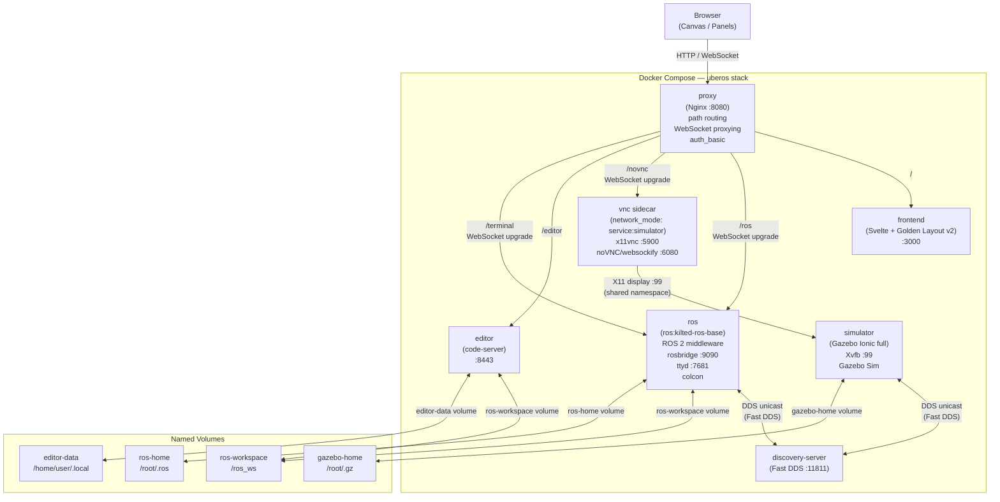
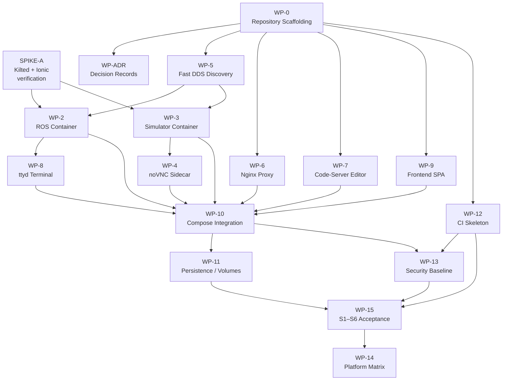

# UbeROS Init Research and Implementation Report

- **Repository:** `jmservera/uberos`
- **Research snapshot:** commit `3d2d4629352fdea8acba94c4fe40a2a7808bd21f`
- **Canonical spec:** [`docs/specs/01-Init.md`][spec-url] (blob `b34760996abe7a4e61a4ef9d9db15e6eecb4e6ac`)
- **Research date:** 2026-07-17
- **Canonical ROS Kilted page:** <https://docs.ros.org/en/kilted/Releases/Release-Kilted-Kaiju.html>

> **Note:** This report is implementation guidance for the canonical spec. The canonical spec remains the source of truth for scope and success criteria.

## Table of Contents

- [Executive Summary](#executive-summary)
- [Decisions Needed](#decisions-needed)
- [Research Scope and Current State](#research-scope-and-current-state)
- [Architecture Decisions and Findings](#architecture-decisions-and-findings)
- [Architecture Overview](#architecture-overview)
- [Requirement Traceability](#requirement-traceability)
- [Proposed Repository Structure](#proposed-repository-structure)
- [Component Design](#component-design)
- [Implementation Roadmap](#implementation-roadmap)
- [Validation Strategy](#validation-strategy)
- [Risks and Fallbacks](#risks-and-fallbacks)
- [Suggested Next Actions](#suggested-next-actions)
- [Confidence and Evidence Gaps](#confidence-and-evidence-gaps)
- [References](#references)

### Key destinations

[Dependency graph](#implementation-dependency-graph) · [SPIKE-A](#spike-a--kilted-and-ionic-image-verification) · [Implementation Roadmap](#implementation-roadmap) · [Validation Strategy](#validation-strategy) · [Risks and Fallbacks](#risks-and-fallbacks) · [Decisions Needed](#decisions-needed) · [Suggested Next Actions](#suggested-next-actions)

## Executive Summary

UbeROS was a Day-0 project at the researched commit: the canonical spec was the only implementation-bearing artifact, and no containers, frontend, ROS packages, tests, or real CI commands existed.[^gap][^test-audit] All six Initial Success Criteria (S1–S6) therefore remained unmet.

Research produced recommended resolutions for all ten research questions in spec §8, but four product choices still require confirmation before implementation: the ROS distribution, reverse proxy, terminal transport, and frontend framework.[^spec-r]

> **Recommendation:** Use ROS 2 Kilted Kaiju with Ubuntu 26.04 “Resolute” and Gazebo Ionic only if the mandatory SPIKE-A verification passes. Use Jazzy Jalisco with Gazebo Harmonic as the verified fallback.[^kilted-base][^ionic-img]

> **Risk:** Kilted was approximately eight weeks old at the research date. Availability of `ros-kilted-rosbridge-suite` and `ros-kilted-ros-gz` remained unverified and can block the first ROS and simulator images.[^spike-a-note]

The implementation roadmap defines dependency-ordered work packages from repository scaffolding through S1–S6 acceptance. The ROS and simulation branches converge at Compose integration, followed by persistence, security, acceptance testing, and platform validation. The original critical-path estimate is approximately 12–18 ideal person-days.

## Decisions Needed

The following four choices block planning or implementation. The research-backed defaults are Kilted subject to SPIKE-A, Nginx, ttyd, and Svelte with Golden Layout v2.

### Quick-Answer Template

Copy, complete, and return this template:

```text
U-D1 ROS Distribution:     [ ] Kilted  [ ] Jazzy  [ ] Humble  [ ] Parameterized (Jazzy now → Kilted later)
U-D2 Reverse Proxy:        [ ] Nginx  [ ] Traefik  [ ] Caddy
U-D3 Terminal Transport:   [ ] ttyd  [ ] xterm.js+custom  [ ] Guacamole
U-D4 Frontend Framework:   [ ] Svelte+GL2  [ ] React+GL2  [ ] Vue+vgl  [ ] VanillaJS+GL2

C-01 Proxy port override (leave blank = 8080):           __________
C-06 Editor product override (leave blank = code-server): __________
C-07 Browser support override (leave blank = Chrome+Firefox): __________
C-09 Simulation world override (leave blank = built-in shapes): __________
```

### U-D1 — ROS 2 Distribution

- **Blocking horizon:** Before WP-0 repository scaffolding and the first ROS Dockerfile.
- **Question:** Which ROS 2 distribution should UbeROS use as its primary baseline?
- **Context:** The user-supplied Kilted Kaiju page signals possible intent to target Kilted. Research found an active Kilted base image and a support horizon of approximately May 2031, but its ecosystem package coverage remained unverified at the research date.[^kilted-base][^ros-eol]
- **Owner:** @juanserv_microsoft for the product decision; Neo for technical verification.

**Options**

1. **Kilted Kaiju** — Ubuntu 26.04, Gazebo Ionic, and the longest expected runway. It carries the highest ecosystem-readiness risk and requires SPIKE-A before any Dockerfile is committed.
2. **Jazzy Jalisco** — Ubuntu 24.04, Gazebo Harmonic, and a proven package and image ecosystem through approximately May 2029.
3. **Humble Hawksbill** — Ubuntu 22.04, Gazebo Fortress, and a large community, but only approximately ten months of support remained at the research date.
4. **Parameterized: Jazzy now, Kilted later** — Start with Jazzy and change `ROS_DISTRO` after Kilted package availability is verified. The later switch is a one-line `.env` change.

> **Recommendation:** Select **Kilted Kaiju** if the intent is to prioritize support runway and SPIKE-A passes. Select the parameterized Jazzy-first option for the lowest delivery risk.

**Answer:** `[ ] Kilted  [ ] Jazzy  [ ] Humble  [ ] Parameterized (Jazzy now → Kilted later)  Other: ____________________`

### U-D2 — Reverse Proxy Product

- **Blocking horizon:** Before WP-0 repository scaffolding.
- **Question:** Which reverse proxy should handle all ingress routing?
- **Context:** Nginx and Traefik both support WebSocket proxying. Nginx is simpler for a fixed, localhost-only Init topology and includes `auth_basic`. Traefik adds dynamic Docker-label routing, which becomes valuable only if the service inventory grows dynamically.
- **Owner:** @juanserv_microsoft for preference; Trinity for implementation.

**Options**

1. **Nginx** — Static `nginx.conf`, built-in `auth_basic`, proven WebSocket support, and minimal infrastructure.
2. **Traefik v3** — Dynamic routing through Docker labels, but requires Docker socket access and additional security consideration.
3. **Caddy** — Automatic TLS and concise configuration, with less community precedent for this ROS/noVNC use case.

> **Recommendation:** Select **Nginx** for the Init stage. Revisit Traefik only if the service topology becomes dynamic.[^q-r1]

**Answer:** `[ ] Nginx  [ ] Traefik  [ ] Caddy  Other: ____________________`

### U-D3 — Terminal Transport

- **Blocking horizon:** Before WP-2 or WP-9 implementation.
- **Question:** Which terminal backend should provide browser-accessible shells in the ROS container?
- **Context:** A terminal design based on `docker exec` would require `/var/run/docker.sock`, effectively granting root-on-host access. Running the terminal backend inside the ROS container avoids that exposure.
- **Owner:** @juanserv_microsoft for preference; Switch for frontend integration.

**Options**

1. **ttyd inside the `ros` container** — WebSocket PTY, bundled xterm.js, no Docker socket exposure, and minimal custom code.
2. **xterm.js with a custom Node.js WebSocket PTY bridge** — More control, but requires custom `node-pty` code and approximately two additional implementation days.
3. **SSH with Apache Guacamole** — Enterprise-grade access with substantial SSH, key-management, and Guacamole infrastructure.

> **Recommendation:** Select **ttyd inside the `ros` container**. Verify the pinned binary for each target architecture alongside SPIKE-A.[^q-r7]

**Answer:** `[ ] ttyd  [ ] xterm.js+custom  [ ] Guacamole  Other: ____________________`

### U-D4 — Frontend Framework and Window Manager

- **Blocking horizon:** Before WP-9 implementation.
- **Question:** Which frontend framework and window-manager library should provide the canvas-style panel UI?
- **Context:** Golden Layout v2 is the primary window-manager recommendation because it supports iframe panels, drag, resize, minimize, tabs, and pop-outs. The framework choice is primarily a team-skill preference.
- **Owner:** Switch for implementation; @juanserv_microsoft for team preference.

**Options**

1. **Svelte + Golden Layout v2** — Small bundle, fast compilation, and Vite-native development; requires Svelte familiarity on the implementation team.
2. **React + Golden Layout v2** — Broader ecosystem and developer familiarity with the same panel capabilities.
3. **Vue + vue-grid-layout** — Viable when the team prefers Vue, but with weaker iframe support than Golden Layout.
4. **Vanilla JavaScript + Golden Layout v2** — No framework overhead, but more explicit application code.

> **Recommendation:** Select **Svelte + Golden Layout v2** as the architecturally motivated default. Confidence is low because no framework benchmark was conducted; React + Golden Layout v2 is equally viable.[^q-r8]

**Answer:** `[ ] Svelte+GL2  [ ] React+GL2  [ ] Vue+vgl  [ ] VanillaJS+GL2  Other: ____________________`

### Recommended Defaults to Confirm or Override

These defaults are evidence-backed and do not block work unless they are overridden.

| ID | Question | Default | Override condition |
|---|---|---|---|
| C-01 | Default proxy port | `8080` through `UBEROS_PORT` | Use `80` when standard HTTP is required |
| C-02 | Initial ROS workspace content | Empty `workspace/src/` | Add a starter ROS package template |
| C-03 | Browser layout persistence | `localStorage`, keyed by origin | Use a backend state API for multi-device sync |
| C-04 | DDS domain ID | `42`, within the cross-platform-safe 0–101 range | Choose another value from 0–101; avoid default `0` when host conflicts are possible |
| C-05 | Concurrent terminal sessions | Minimum of 2 | Increase for higher shell concurrency |
| C-06 | Code editor | `code-server` | Use another self-hostable editor with a file API |
| C-07 | Browser support | Latest two stable Chrome/Edge and Firefox releases | Add Safari if required; review SharedWorker edge cases |
| C-08 | `docker compose down -v` | Document as destructive | Add a guard script or Makefile target |
| C-09 | Init simulation world | `uberos_default.sdf` with built-in shapes | Supply a custom SDF world |

### Deferred Questions

Do not raise these items during Init unless the scope changes.

| ID | Question | Reason for deferral |
|---|---|---|
| D-01 | Terminal continuity after a container restart | Spec §9 explicitly defers it; S1–S6 do not require it |
| D-02 | Streaming FPS and latency thresholds | Spec §7 N-08 defers them to a later research phase |
| D-03 | Full Linux, WSL2, and macOS validation results | Produced by WP-14 during implementation |
| D-04 | OAuth provider for public deployment | Relevant only before non-localhost exposure |
| D-05 | `foxglove_bridge` evaluation | Milestone 2+, after N-08 targets exist |
| D-06 | Git LFS for large mesh or URDF assets | No robot models are included in Init |
| D-07 | Fuel model licensing audit | Deferred until custom models are added |
| D-08 | Multi-user RBAC | Post-Init security milestone |
| D-09 | rosbridge QoS reconnect tuning | Default `unregister_timeout` is adequate for Init |

## Research Scope and Current State

### Research Scope

This report synthesizes requirement extraction, implementation gap analysis, test coverage, architecture context, project history, ROS/Gazebo compatibility, Docker Compose platform feasibility, browser bridge technology, workspace and storage strategy, decision analysis, implementation planning, and evidence review.

The findings apply to repository `jmservera/uberos` at commit `3d2d4629`. Recommendations and estimates are explicitly identified; factual claims are tied to primary sources or research evidence records.

### Repository State at the Researched Commit

| Artifact category | State | Evidence |
|---|---|---|
| Canonical spec | One file: `docs/specs/01-Init.md` | Repository blob listing[^spec-url] |
| Dockerfiles | None | Repository gap analysis[^gap] |
| Compose files | None | Repository gap analysis[^gap] |
| Frontend source | None | No project `.ts`, `.tsx`, `.svelte`, `.vue`, or `.js` files[^gap] |
| Tests | None | No test files or test directories[^test-audit] |
| ROS package files | None | No `package.xml` or `CMakeLists.txt`[^gap] |
| CI commands | Placeholder only | Existing build/test jobs only echoed “No build commands configured”[^ci-echo] |
| Recorded decisions | None | `.squad/decisions.md` stated “No decisions recorded yet”[^decisions-empty] |
| Open GitHub issues | None | GitHub Issues API returned an empty result[^hist] |

> **Note:** All six Initial Success Criteria (S1–S6) failed at this snapshot. The project was correctly positioned at the start of the Research Phase described in spec §11.[^now-md]

### Key Assumptions

| ID | Assumption | Basis |
|---|---|---|
| A-1 | V1 is single-user; no session isolation or multi-tenant routing | Default established by the decision dossier because the spec defines no user model[^q-dossier] |
| A-2 | S1–S6 acceptance is localhost-only; N-05 applies before non-localhost exposure | Decision-dossier adjudication of contradiction C-02[^q-dossier] |
| A-3 | Orchestration uses the Docker Compose V2 plugin, `docker compose`, not deprecated Compose V1 | Compose V1 was deprecated in mid-2023[^q-dossier] |
| A-4 | `workspace/src/` is bind-mounted; build artifacts use named volumes | Named volumes avoid common macOS and WSL2 filesystem penalties[^compose-plat] |
| A-5 | `--headless-rendering` is never enabled by default because S4 requires the Gazebo GUI in noVNC | Spec S4 and GUI-streaming research[^spec-url][^no-headless] |
| A-6 | `hub.docker.com/_/gazebo` is deprecated and has no supported tags | Spec §13 and repository evidence review[^spec-neo-hist] |
| A-7 | Gazebo Classic 11 is excluded because it reached EOL on 2025-01-25 | Gazebo version and EOL table[^gz-eol] |

## Architecture Decisions and Findings

### Spec-Locked Decisions

These decisions are already established by the canonical spec and should not be reopened during Init.

| ID | Decision | Spec basis |
|---|---|---|
| D1 | The product starts with `docker compose up`; the host requires nothing beyond Docker | §1 and §2[^spec-url] |
| D2 | Docker Compose V2 is the orchestration layer | §5 and §9[^spec-url] |
| D3 | Workload and browser-view lifecycles are independent | §9 L123–132[^spec-lifecycle] |
| D4 | Closing a pop-out must not terminate its workload | §9 L132[^spec-lifecycle] |
| D5 | noVNC, or an equivalent WebSocket/VNC bridge, streams the simulator GUI | §5 L51[^spec-url] |
| D6 | The browser provides a canvas window manager with drag, resize, and minimize | §5 L54 and §3 L26[^spec-url] |
| D7 | One reverse proxy is the sole ingress and future TLS termination point | §3 G7 and §5 L55–56[^spec-url] |
| D8 | Workspace files, ROS state, and configuration persist through Docker volumes | §7 L100[^spec-url] |
| D9 | Access control is required before any non-localhost exposure | §7 L103[^spec-url] |
| D10 | Research follows HVE Core; planning follows RPI | §11[^spec-url] |
| D11 | R10 is settled by §9: browser closure does not stop containers | §9[^spec-lifecycle] |

### Research Question Resolutions

1. **R1 — Nginx vs. Traefik**
   - **Resolution:** Nginx, because static configuration, `auth_basic`, WebSocket support, and minimal infrastructure fit Init.
   - **Confidence:** Medium; Nginx has stronger evidence, but Traefik was not independently benchmarked.[^q-r1]
2. **R2 — ROS distribution**
   - **Resolution:** Kilted Kaiju, subject to SPIKE-A; Jazzy Jalisco is the low-risk fallback.
   - **Confidence:** High for Jazzy and medium for Kilted because Kilted was recently released.[^kilted-base][^ros-eol]
3. **R3 — Gazebo generation and registry**
   - **Resolution:** Gazebo Ionic (`gz-sim10`) from `ghcr.io/openrobotics/gazebo:ionic-full`; Gazebo Classic 11 is excluded.
   - **Confidence:** High for EOL and image availability.[^ionic-img][^gz-eol]
4. **R4 — GUI streaming topology**
   - **Resolution:** Shared Xvfb display `:99`, x11vnc, and a noVNC sidecar using `network_mode: service:simulator`, with software rendering.
   - **Confidence:** High; four research records converged on this topology.[^q-r4]
5. **R5 — Authentication**
   - **Resolution:** Nginx `auth_basic` for Init, with OAuth2-Proxy as the public-deployment upgrade path.
   - **Confidence:** High for Init and medium for production.[^q-r5]
6. **R6 — GPU vs. software rendering**
   - **Resolution:** Mesa llvmpipe software rendering by default; NVIDIA acceleration is an opt-in Compose override.
   - **Confidence:** High because macOS lacks container GPU passthrough and the baseline must remain portable.[^gpu-macos]
7. **R7 — Terminal transport**
   - **Resolution:** ttyd inside the `ros` container, with no Docker socket exposure.
   - **Confidence:** Medium; the approach is established, but the image and architecture matrix require verification.[^q-r7]
8. **R8 — Frontend framework**
   - **Resolution:** Svelte with Golden Layout v2, subject to U-D4.
   - **Confidence:** Low because no framework benchmark was conducted.[^q-r8]
9. **R9 — Pop-out and reattach**
   - **Resolution:** `BroadcastChannel` for same-origin panel state and `postMessage` for parent-to-iframe communication.
   - **Confidence:** High because target browser support is broad and rosbridge connections are lifecycle-independent.[^q-r9]
10. **R10 — Lifecycle coupling**
    - **Resolution:** Already settled by spec §9. Closing a browser view does not stop a workload; layout restores from `localStorage`.
    - **Confidence:** High because the spec is explicit.[^spec-lifecycle]

### ROS 2 Kilted Kaiju Evidence

> **Note:** Evidence correction MC-1: Kilted uses Ubuntu 26.04 “Resolute,” not Ubuntu 24.04 “Noble,” which is Jazzy’s base. The evidence is the `ros:kilted-ros-base-resolute` Docker tag.[^kilted-base]

> **Note:** Evidence correction MC-2: The Ubuntu base is supported by Docker Hub tag data and the ROS lifecycle record, not by the Kilted release page, which focuses on language and runtime features.[^ros-eol]

| Fact | Finding | Evidence |
|---|---|---|
| Release date | 2026-05-22 | ROS lifecycle record and Kilted release page[^ros-eol][^kilted-page] |
| Expected EOL | Approximately May 2031 | ROS lifecycle record[^ros-eol] |
| Ubuntu base | 26.04 “Resolute,” inferred from the `-resolute` image tag and release cadence | Docker Hub tag API[^kilted-base] |
| LTS status | Supported inference; not yet represented in REP-2000 | ROS lifecycle record, Ionic LTS designation, and REP-2000 gap[^ros-eol][^ionic-img][^rep2000] |
| Docker image | `ros:kilted-ros-base`, active for amd64 and arm64 at the research date | Docker Hub v2 API[^kilted-base] |
| Gazebo pairing | Gazebo Ionic (`gz-sim10`) through vendor packages | ROS/Gazebo installation guidance[^ros-gz-pair] |
| New features | EventsCBGExecutor, AsyncNode, `rosidl::Buffer`, YAML type annotations, and fish shell support | Kilted release page[^kilted-page] |
| Fish setup | `source /opt/ros/kilted/setup.fish` | Kilted release page[^kilted-page] |
| REP-2000 status | No Kilted section at the research date | Live REP-2000 review[^rep2000] |

> **Risk:** SPIKE-A must pass before Kilted appears in any committed Dockerfile. It verifies the base image, rosbridge package, Ionic image, `ros-gz` package, and software rendering.

## Architecture Overview

### Service and Data Flow



> **Decision:** All browser traffic passes through the single Nginx proxy, satisfying spec INV-04 and same-origin iframe routing requirement I-12.[^spec-url]

> **Note:** The VNC sidecar uses `network_mode: "service:simulator"` so it can reach the virtual framebuffer through the simulator’s network namespace without publishing VNC to an external network.[^q-r4]

> **Risk:** rosbridge port `9090` and ttyd port `7681` must never be published to the host. They are reachable only through the proxy.[^bridge-auth]

### Implementation Dependency Graph



> **Note:** The ROS branch (`WP-5 → WP-2`) and simulation branch (`WP-5 → WP-3 → WP-4`) converge at WP-10. Integration then proceeds through persistence, acceptance, and platform validation. The critical-path estimate is approximately 12–18 ideal person-days.

After WP-0, WP-5, WP-6, WP-7, WP-9, and WP-12 can proceed in parallel.

## Requirement Traceability

### Functional Requirements

| ID | Requirement | Spec basis | Work package(s) | Acceptance evidence |
|---|---|---|---|---|
| F-01 | Full ROS stack in Docker Compose | §3 G1; L22 | WP-2, WP-5 | `ros2 node list` responds; topics and services work |
| F-02 | Physics simulator runs in Compose without a host display | §3 G2; L23; L50 | WP-3, WP-5 | `pgrep gz` exits 0 in the simulator |
| F-03 | Simulator GUI streams through noVNC | §3 G2; L23; L51 | WP-3, WP-4, WP-6 | `/novnc/websockify` upgrades to WebSocket; S4 passes |
| F-04 | Self-hostable browser code editor | §3 G3; L24; L52 | WP-7, WP-11 | `GET /editor/` returns 200; S6 passes |
| F-05 | Multiple independent terminal sessions | §3 G4; L25; L53 | WP-8, WP-6 | At least two concurrent WebSocket PTY sessions have independent processes |
| F-06 | Canvas window manager supports drag, resize, and minimize | §3 G5; L26; §5 L54 | WP-9 | S2 passes; panels respond to all three gestures |
| F-07 | A panel can pop out without terminating its workload | §3 G6; L27–28; §9 L132 | WP-9, WP-10 | S5 and INV-01 pass |
| F-08 | One reverse proxy provides path routing | §3 G7; L29; L55–56 | WP-6 | Root returns 200 and every subpath routes correctly |
| F-09 | Compose defines all services, networks, and volumes | §5 L57 | WP-10 | `docker compose config --quiet` exits 0 |
| F-10 | `docker compose up` starts without error | §10 S1; L136 | WP-10, WP-12 | Every defined service becomes healthy within 120 seconds |
| F-11 | Browser shows the canvas with at least one panel | §10 S2; L137 | WP-6, WP-9 | Root returns 200 and DOM contains at least one `iframe[src]` |
| F-12 | A ROS command runs in a browser terminal | §10 S3; L138 | WP-8, WP-9 | `ros2 topic list` returns output within 5 seconds |
| F-13 | Simulator GUI is visible in the noVNC panel | §10 S4; L139 | WP-3, WP-4, WP-6 | A non-blank VNC frame appears within 30 seconds; no `--headless-rendering` |
| F-14 | A panel opens separately while its session continues | §10 S5; L140 | WP-9 | `window.open()` succeeds and Compose services remain running |
| F-15 | The editor opens, edits, and saves in the ROS workspace | §10 S6; L141 | WP-7, WP-11 | A saved file is readable from the ROS container |
| F-16 | First launch shows ROS status, simulator, editor, and terminal panels | §4 J1; L34 | WP-9 | Four panels render with empty `localStorage` |
| F-17 | `colcon` is usable from the terminal panel | §4 J2; L37 | WP-2, WP-8 | `colcon build --help` exits 0 in the browser terminal |

### Non-Functional Requirements

| ID | Requirement | Spec basis | Work package(s) | Testable criterion |
|---|---|---|---|---|
| N-01 | Volumes preserve data across restarts | §7 L100; §4 J4 L43 | WP-11 | A file written before `down` remains after `up` |
| N-02 | The host requires no software beyond Docker | §1 L13; §7 L101 | WP-10, WP-14 | A fresh host with Docker can run `docker compose up` |
| N-03 | Service boundaries reflect lifecycle, security, and resources | §7 L101 | WP-10 | Services remain distinct and single-purpose |
| N-04 | Adding a ROS package requires only Dockerfile or Compose changes | §7 L102 | WP-2, WP-10 | A new service layer and Compose edit build in CI |
| N-05 | Authentication precedes public exposure | §7 L103 | WP-13 | Unauthenticated requests return 401 when `UBEROS_AUTH=basic` |
| N-06 | Logs are aggregated and every service has a health check | §7 L104 | WP-10, WP-12 | `docker compose logs` includes every service and all health checks pass |
| N-07 | Linux, macOS Docker Desktop, and WSL2 have a validation matrix | §7 L97–99 | WP-14 | Each platform tier has documented pass/fail results |
| N-08 | Streaming performance targets are a research deliverable | §7 L99 | Deferred | Not an Init acceptance criterion |

### Invariants

| ID | Invariant | Enforcement |
|---|---|---|
| INV-01 | Closing a pop-out must not terminate its workload | WP-9 acceptance gate and L5-T4 multi-window E2E |
| INV-02 | Container restart must not lose workspace or configuration | WP-11 acceptance gate and L3-T1 persistence test |
| INV-03 | The host requires nothing beyond Docker | WP-14 platform validation and CI gate |
| INV-04 | All browser-to-service traffic passes through one proxy | WP-6; backend ports are not host-published |
| INV-05 | Workload and browser-view lifecycles remain independent | WP-10 design; INV-01 is a corollary |

### Implied Requirements

| ID | Implied requirement | Work package |
|---|---|---|
| I-01 | The proxy supports WebSocket upgrades | WP-6 |
| I-02 | The proxy is the future TLS termination point | WP-13 |
| I-03 | Editor and ROS share a workspace volume | WP-11 |
| I-04 | Each terminal connection receives an independent PTY | WP-8 |
| I-05 | The window manager embeds services as iframes | WP-9 |
| I-06 | `docker compose up` exposes one stable URL | WP-6 |
| I-07 | The terminal backend is network-reachable in the ROS container | WP-10 |
| I-08 | Simulator and ROS share DDS networking | WP-5, WP-10 |
| I-09 | The simulator provides Xvfb display `:99` | WP-3 |
| I-10 | A VNC server is adjacent to the simulator display | WP-4 |
| I-11 | The ROS image includes `colcon` | WP-2 |
| I-12 | Proxy routing gives iframe panels a shared origin | WP-6 |
| I-13 | The editor writes to the workspace used by the ROS build toolchain | WP-11 |
| I-14 | A reattached pop-out resumes the same panel session | WP-9 |
| I-15 | rosbridge starts automatically with Compose | WP-2 |

### Out of Scope for Init

| ID | Item | Basis |
|---|---|---|
| OOS-01 | Terminal process and shell-history continuity across container restarts | §4 J4 and §9 L128 |
| OOS-02 | Streaming FPS and latency thresholds | §7 N-08 |
| OOS-03 | Multi-user RBAC or session isolation | Single-user assumption A-1 |
| OOS-04 | Foxglove Bridge evaluation | Deferred to milestone 2+ |
| OOS-05 | Fuel model licensing audit | Deferred until custom models are added |
| OOS-06 | Git LFS for large mesh assets | No robot models in Init |
| OOS-07 | rosbridge QoS reconnect tuning | Init uses adequate defaults |
| OOS-08 | `web_video_server` camera streaming | S1–S6 define no camera topics |
| OOS-09 | TLS on localhost | Required only before public exposure |

## Proposed Repository Structure

```text
uberos/
├── compose.yaml
├── compose.override.gpu.yaml
├── .env
├── .gitignore
├── .gitattributes
│
├── services/
│   ├── ros/
│   │   ├── Dockerfile
│   │   ├── entrypoint.sh
│   │   └── config/
│   │       └── dds_discovery.xml
│   ├── simulator/
│   │   ├── Dockerfile
│   │   ├── entrypoint.sh
│   │   └── config/
│   │       └── fuel.yaml
│   ├── vnc/
│   │   ├── Dockerfile
│   │   └── entrypoint.sh
│   ├── proxy/
│   │   └── nginx.conf
│   ├── editor/
│   │   └── Dockerfile
│   └── frontend/
│       ├── Dockerfile
│       ├── package.json
│       └── src/
│           ├── App.svelte
│           └── lib/
│               ├── panels/
│               └── window-manager/
│
├── workspace/
│   ├── src/
│   └── colcon_defaults.yaml
│
├── simulation/
│   ├── worlds/
│   │   └── uberos_default.sdf
│   └── models/
│
├── config/
│   └── nginx/
│
├── docs/
│   ├── specs/
│   │   └── 01-Init.md
│   └── decisions/
│       ├── ADR-001-ros-distro.md
│       ├── ADR-002-proxy.md
│       ├── ADR-003-terminal.md
│       ├── ADR-004-frontend.md
│       └── ADR-005-auth.md
│
└── .github/
    └── workflows/
        └── squad-ci.yml
```

The proposed files map to the roadmap as follows:

- `compose.yaml` and `compose.override.gpu.yaml`: WP-10 and R6.
- `services/ros/`: WP-2 and WP-5.
- `services/simulator/`: WP-3.
- `services/vnc/`: WP-4; Ubuntu 24.04 with x11vnc, noVNC, and websockify.
- `services/proxy/`: WP-6.
- `services/editor/`: WP-7.
- `services/frontend/`: WP-9; a Vite build served by Nginx in a multi-stage image.
- `workspace/`: WP-11.
- `simulation/`: WP-3; the Init world uses built-in shapes and commits no Fuel-downloaded models.
- `config/nginx/`: Shared proxy configuration and authentication material.
- `docs/decisions/`: WP-ADR.
- `.github/workflows/squad-ci.yml`: WP-12; replace placeholder CI commands.

The canonical `docs/specs/01-Init.md` remains unchanged.

**Committed `.env` defaults contain no secrets:**

```dotenv
ROS_DISTRO=kilted
GZ_RELEASE=ionic
UBEROS_PORT=8080
ROS_DOMAIN_ID=42
RMW_IMPLEMENTATION=rmw_fastrtps_cpp
LIBGL_ALWAYS_SOFTWARE=1
MESA_GL_VERSION_OVERRIDE=3.3
MESA_GLSL_VERSION_OVERRIDE=330
```

> **Risk:** `docker compose down -v` destroys named volumes, including workspace data. `docker compose down` without `-v` retains them. This must be prominent in user documentation.[^compose-down-v]

## Component Design

### Container and Compose Platform

The proposed topology contains two networks, five named volumes, and the services shown below.

```yaml
# compose.yaml — structural outline
networks:
  ros_net:
    # ROS DDS traffic and simulator traffic; internal to Docker
  web_net:
    # Proxy-facing services with external access

volumes:
  ros-workspace:
    # /ros_ws — source, build, install, and logs
  ros-home:
    # /root/.ros — ROS runtime logs
  gazebo-home:
    # /root/.gz — Fuel cache and Gazebo GUI configuration
  editor-data:
    # /home/user/.local/share/code-server
  workspace-config:
    # Read-only shared configuration

services:
  discovery-server:
    # ros_net; Fast DDS :11811
  ros:
    # ros_net + web_net; rosbridge :9090 and ttyd :7681
  simulator:
    # ros_net + web_net; shares its network namespace with vnc
  vnc:
    # network_mode: service:simulator; x11vnc :5900 and noVNC :6080
  editor:
    # web_net; code-server :8443
  proxy:
    # web_net; Nginx :8080, the only host-published port
  frontend:
    # web_net; Svelte SPA :3000
```

**Stop grace periods**

- `ros`: 30 seconds.
- `simulator`: 60 seconds, because Gazebo can shut down slowly.
- `discovery-server`: 5 seconds.[^compose-startup]

**Startup ordering**

```text
discovery-server [healthy]
  ↓ condition: service_healthy
ros [healthy] + simulator [healthy]
  ↓
vnc [depends on simulator health]
  ↓
proxy [depends on ros, vnc, and editor health]
```

### ROS Workspace and Nodes

**Base image:** `ros:${ROS_DISTRO}-ros-base`. The `ros-base` variant includes the expected `colcon`, `rosdep`, and `vcstool` development tooling; `ros-core` does not.[^ros-docker-hub]

**Workspace layout**

```text
/ros_ws/
├── src/       # Bind-mounted from workspace/src/; user-editable
├── build/     # Named-volume data; regenerable
├── install/   # Named-volume data; sourced by the entrypoint
└── log/       # Named-volume data; timestamped build logs
```

Keeping `build/`, `install/`, and `log/` out of host bind mounts avoids common Docker Desktop filesystem penalties.

**Recommended `colcon_defaults.yaml`**[^colcon-docs]

```yaml
build:
  symlink-install: true
  event-handlers:
    - console_direct+

test:
  event-handlers:
    - console_direct+
```

**Entrypoint pattern**

```bash
#!/bin/bash
set -e

source "/opt/ros/${ROS_DISTRO}/setup.bash"
[ -f /ros_ws/install/setup.bash ] && source /ros_ws/install/setup.bash

ttyd --port 7681 --writable bash &
exec ros2 launch rosbridge_server rosbridge_websocket_launch.xml port:=9090
```

**DDS environment in every ROS-capable container**

```text
ROS_DOMAIN_ID=42
ROS_DISCOVERY_SERVER=discovery-server:11811
RMW_IMPLEMENTATION=rmw_fastrtps_cpp
FASTRTPS_DEFAULT_PROFILES_FILE=/etc/ros/dds_discovery.xml
```

Domain ID `42` is inside the cross-platform-safe range of 0–101.[^dds-domain]

> **Recommendation:** Use a Fast DDS Discovery Server because Docker bridge networks do not reliably carry the multicast discovery used by default DDS configuration. Without explicit discovery, ROS nodes in separate containers can silently fail to find each other.[^dds-multicast]

### Gazebo, World Assets, and GUI Streaming

**Container image:** `ghcr.io/openrobotics/gazebo:${GZ_RELEASE}-full`, with amd64 and arm64 support recorded for Ionic.[^ionic-img]

**Software-rendering environment**[^ogre2-mesa]

```text
DISPLAY=:99
LIBGL_ALWAYS_SOFTWARE=1
MESA_GL_VERSION_OVERRIDE=3.3
MESA_GLSL_VERSION_OVERRIDE=330
```

**Xvfb and Gazebo startup**

```bash
Xvfb :99 -screen 0 1920x1080x24 +extension GLX -ac &
sleep 3

exec gz sim --verbose 1 /simulation/worlds/uberos_default.sdf
```

> **Decision:** Do not set `--headless-rendering` when S4 requires a visible GUI. The supported pattern is Gazebo rendering to Xvfb display `:99`, with the VNC sidecar streaming that display.[^no-headless]

**Gazebo resource path**[^gz-resource-path]

```text
GZ_SIM_RESOURCE_PATH=/simulation/models:/simulation/worlds
```

`simulation/worlds/uberos_default.sdf` uses only Gazebo built-in primitive shapes, which avoids Fuel downloads and model-license review during Init.[^fuel-license]

The Fuel cache at `/root/.gz/fuel/` persists in the `gazebo-home` volume. Automatic Fuel downloads should be disabled through `fuel.yaml` for Init; custom models can be added after a licensing audit.[^fuel-license]

**VNC sidecar topology**[^q-r4]

```yaml
vnc:
  build:
    context: ./services/vnc
  network_mode: "service:simulator"
  environment:
    DISPLAY: ":99"
  depends_on:
    simulator:
      condition: service_healthy
```

- x11vnc listens on port `5900` inside the simulator’s shared network namespace.
- `websockify --web /usr/share/novnc/ 6080 localhost:5900` serves noVNC to the proxy at `/novnc/`.

### Browser-to-ROS Bridge

**Pattern A — Recommended for Init: rosbridge_suite with roslibjs**[^rosbridge]

- **Server package:** `ros-jazzy-rosbridge-suite` or `ros-kilted-rosbridge-suite`; Kilted availability is a SPIKE-A gate.
- **Internal port:** `9090`, never published to the host.
- **Client:** `roslib` v2.1.0, ESM and TypeScript compatible, requiring Node.js 20 or later.
- **Install command:** `npm install roslib`.
- **Operations:** topic advertise, publish, and subscribe; service calls; action advertisement and goals; QoS support; and CBOR binary encoding.[^rosbridge]

> **Risk:** rosbridge’s `check_origin` returns `True` unconditionally, so the bridge has no native origin or authentication protection. Keep port `9090` internal and enforce access at Nginx.[^bridge-auth]

roslibjs does not reconnect automatically.[^roslibjs] The application must schedule retries, for example:

```typescript
ros.on('close', () => scheduleReconnect());

function scheduleReconnect(attempt = 0) {
  setTimeout(
    () => ros.connect(url),
    Math.min(1000 * 2 ** attempt, 30000),
  );
}
```

The ROS Status panel can call `/rosapi/nodes` and subscribe to `/rosout` for a last-20-lines log view without additional packages.

**Pattern B — Deferred: `foxglove_bridge`**

`foxglove_bridge` is a higher-performance C++ alternative, but it uses the Foxglove protocol and is not compatible with roslibjs.[^bridge-incompat] Evaluate it in milestone 2 or later after N-08 performance targets exist.

### Web UI and Window Manager

> **Recommendation:** Use Svelte, Vite, and Golden Layout v2 if U-D4 confirms the research default. Confidence remains low because no framework benchmark was conducted.[^q-r8]

Golden Layout v2 supplies iframe panels, drag, resize, minimize, tabs, and pop-out support. The minimize requirement follows the more specific capability language in spec §5.[^c04] Same-origin proxy routing satisfies iframe requirement I-05 and routing requirement I-12.

**Pop-out state synchronization**[^q-r9]

```typescript
const bc = new BroadcastChannel('uberos-panels');

function popOut(panelId: string, url: string) {
  window.open(url, panelId, 'noopener');
  bc.postMessage({ type: 'panel-opened', panelId });
}

window.addEventListener('beforeunload', () => {
  bc.postMessage({
    type: 'panel-closed',
    panelId: currentPanelId,
  });
});
```

Closing a pop-out sends browser state only; it never stops a Compose service. Layout persists in `localStorage`, keyed by origin, and survives browser refreshes as required by spec §9.[^spec-lifecycle]

The first-launch layout contains:

1. **ROS Status** — `/rosapi/nodes` plus `/rosout`.
2. **Simulator View** — noVNC iframe.
3. **Terminal** — ttyd iframe.
4. **Code Editor** — code-server iframe.

### Configuration, Persistence, and Volumes

| Data | Storage | Compose mount | Notes |
|---|---|---|---|
| ROS workspace source, `workspace/src/` | Git and bind mount | `/ros_ws/src` | User-editable and shared by editor and ROS |
| ROS `build/`, `install/`, and `log/` | `ros-workspace` named volume | `/ros_ws` | Regenerable; not host-bind-mounted |
| ROS runtime logs, `/root/.ros/` | `ros-home` named volume | `/root/.ros` | Matches ROS image guidance[^ros-docker-hub] |
| Gazebo cache, `/root/.gz/fuel/` | `gazebo-home` named volume | `/root/.gz` | Downloaded assets persist |
| Editor settings | `editor-data` named volume | `/home/user/.local/share/code-server` | Extensions and preferences |
| Simulation worlds and models | Git | `/simulation` | Version-controlled; built-in content is Apache 2.0 |
| `.env` non-secret settings | Git | Loaded by Compose | ROS distribution, Gazebo release, ports, and rendering |
| Browser panel layout | `localStorage` | Client-side only | Follows spec §9 L130 |

This strategy follows the storage research and Docker volume guidance.[^bc97c0-vol]

> **Risk:** Named volumes survive `docker compose down`, but `docker compose down -v` destroys them. Treat `-v` as a destructive operation and document it prominently.[^compose-down-v]

### Security, Safety, and Observability

**Authentication**

- **Localhost Init:** Nginx `auth_basic` is disabled by default.
- **Optional local gate:** Set `UBEROS_AUTH=basic` and mount `.htpasswd`.
- **Before public exposure:** Enable at least `auth_basic`; OAuth2-Proxy with GitHub, Azure AD, or Google OIDC is the recommended upgrade.[^q-r5]
- **rosbridge:** Never publish port `9090`; route it only through the proxy.[^bridge-auth]

**Health checks required by N-06**[^compose-health]

| Service | Health-check command |
|---|---|
| `discovery-server` | `echo > /dev/tcp/localhost/11811` |
| `ros` | `ros2 node list` or `pgrep -f rosbridge` |
| `simulator` | `pgrep Xvfb && pgrep gz` |
| `vnc` | `curl -sf http://localhost:6080/` |
| `proxy` | `curl -sf http://localhost:8080/` |
| `editor` | `curl -sf http://localhost:8443/` |
| `frontend` | `curl -sf http://localhost:3000/` |

**GPU passthrough**

Use Compose V2 `deploy.resources.reservations.devices`, not deprecated `runtime: nvidia`.[^gpu-compose] Non-NVIDIA hosts ignore the opt-in override.

**Privilege minimization**

No service requires `privileged: true`. Device access must use specific capabilities or device mappings.[^compose-plat]

**Logs**

All services use Docker’s default JSON log driver. `docker compose logs --follow` provides aggregate logs, so Init needs no custom `logging:` block.[^compose-health]

### Developer Experience

- **Start:** `docker compose up`, or `docker compose up -d` in detached mode.
- **GPU opt-in on Linux/NVIDIA:** `docker compose -f compose.yaml -f compose.override.gpu.yaml up`.
- **Build all images:** `docker compose build`.
- **Build one image:** `docker compose build ros`.
- **Open a ROS shell:** `docker compose exec ros bash`, then source `/opt/ros/${ROS_DISTRO}/setup.bash`.

**ROS development loop**

1. Edit a file in the `/editor` code-server panel.
2. Open a terminal and run `cd /ros_ws && colcon build --symlink-install`.
3. Run `source install/setup.bash`.
4. Run `ros2 run <pkg> <node>` or `ros2 launch ...`.
5. Observe the result in the Simulator or ROS Status panel.

Repository branches follow `squad/{issue-number}-{slug}`.[^hist]

## Implementation Roadmap

Work packages are ordered by dependency and critical-path sequence, not by numeric ID. WP-ADR starts on Day 2–3 after the early decisions and SPIKE-A result; its detailed definition appears later only as a reference. The [dependency graph](#implementation-dependency-graph) shows structural prerequisites, while [Suggested Next Actions](#suggested-next-actions) maps that graph to the day-by-day execution sequence.

> **Note:** Sizing uses ideal person-days: **S** = 0.5–1 day, **M** = 2–4 days, and **L** = 5–8 days. These are estimates, not commitments.

Owners follow the team roles defined by spec §12.[^spec-url]

### SPIKE-A — Kilted and Ionic Image Verification

- **Owner:** Neo.
- **Size:** S.
- **Prerequisites:** None.
- **Blocks:** WP-2 and WP-3.
- **Goal:** Confirm Kilted and Ionic ecosystem readiness before authoring Dockerfiles.

**Probe commands**

```bash
# P1: Kilted base image
docker run --rm ros:kilted-ros-base \
  bash -c "source /opt/ros/kilted/setup.bash && ros2 --version"
# Expected: ros2 reports the Kilted version.

# P2: rosbridge availability for Kilted
docker run --rm ros:kilted-ros-base \
  bash -c "apt-get update -q && apt-cache show ros-kilted-rosbridge-suite" \
  2>&1 | grep -E "Package|Version|Unable"

# P3: Gazebo Ionic full image
docker run --rm ghcr.io/openrobotics/gazebo:ionic-full \
  gz sim --version
# Expected: Gazebo Sim 10.x.x.

# P4: ros-gz vendor package for Kilted and Ionic
docker run --rm ros:kilted-ros-base \
  bash -c "apt-get update -q && apt-cache show ros-kilted-ros-gz" \
  2>&1 | grep -E "Package|Version"

# P5: Software rendering in Ionic
docker run --rm \
  -e LIBGL_ALWAYS_SOFTWARE=1 \
  -e MESA_GL_VERSION_OVERRIDE=3.3 \
  ghcr.io/openrobotics/gazebo:ionic-full \
  bash -c "apt-get install -y -q mesa-utils && glxinfo -B" \
  2>&1 | grep -i renderer
# Expected: renderer contains "llvmpipe".
```

**Decision tree**

| Probe result | Action |
|---|---|
| All probes pass | Use `ROS_DISTRO=kilted` and `GZ_RELEASE=ionic` |
| P2 fails | Install rosbridge from source in WP-2 and record the exception in ADR-001 |
| P3 fails | Fall back to `ghcr.io/openrobotics/gazebo:harmonic-full` with Jazzy |
| P5 fails | Add `GALLIUM_DRIVER=llvmpipe`; if it still fails, use Jazzy and Noble |

**Definition of done**

- Record probe results and the go/no-go decision in `docs/decisions/ADR-001-ros-distro.md`.
- Confirm the `.env` values for `ROS_DISTRO` and `GZ_RELEASE`.

### WP-0 — Repository Scaffolding

- **Owner:** Trinity.
- **Size:** S.
- **Prerequisites:** U-D1 through U-D4.
- **Can run with:** SPIKE-A.

**Files to create**

- `compose.yaml` and `compose.override.gpu.yaml` stubs.
- `.env`, `.gitignore`, and `.gitattributes`.
- Stub Dockerfiles and entrypoints under every `services/` component.
- Empty `workspace/src/`.
- `workspace/colcon_defaults.yaml`.
- `simulation/worlds/uberos_default.sdf`.
- Five ADR stubs under `docs/decisions/`.

**Definition of done**

- `docker compose config` parses without error.
- No stub service starts yet.
- `docs/decisions/` contains the five ADR files.
- The intended scaffold is committed and `git status` is clean.

### WP-5 — Fast DDS Discovery Service

- **Owner:** Neo.
- **Size:** S.
- **Prerequisites:** WP-0 and SPIKE-A.
- **Blocks:** WP-2 and WP-3.
- **Files:** `services/ros/config/dds_discovery.xml` and the `discovery-server` service in `compose.yaml`.

**Compose outline**

```yaml
discovery-server:
  image: ros:${ROS_DISTRO:-kilted}-ros-base
  command: fastdds discovery -i 0 -l 0.0.0.0 -p 11811
  networks:
    - ros_net
  restart: unless-stopped
  healthcheck:
    test:
      - CMD-SHELL
      - echo > /dev/tcp/localhost/11811 2>/dev/null && echo ok || exit 1
    interval: 5s
    timeout: 3s
    retries: 10
    start_period: 5s
```

**Definition of done**

- `docker compose up discovery-server` passes its health check.
- A TCP probe from another `ros_net` container exits 0.

### WP-2 — ROS 2 Core Container

- **Owner:** Neo.
- **Size:** M.
- **Prerequisites:** WP-0, SPIKE-A, and WP-5.
- **Blocks:** WP-8 and WP-10.
- **Files:** `services/ros/Dockerfile` and `services/ros/entrypoint.sh`.

**Dockerfile outline**

```dockerfile
ARG ROS_DISTRO=kilted
FROM ros:${ROS_DISTRO}-ros-base

RUN apt-get update \
  && apt-get install -y --no-install-recommends \
    python3-colcon-common-extensions \
    python3-rosdep \
    python3-vcstool \
    ros-${ROS_DISTRO}-rosbridge-suite \
    ros-${ROS_DISTRO}-rosapi \
    ros-${ROS_DISTRO}-ros-gz \
    curl \
    wget \
  && rosdep init \
  && rosdep update \
  && rm -rf /var/lib/apt/lists/*

# Illustrative only: replace latest/x86_64 with a pinned,
# TARGETARCH-aware download before implementation.
RUN curl -L \
    https://github.com/tsl0922/ttyd/releases/latest/download/ttyd.x86_64 \
    -o /usr/local/bin/ttyd \
  && chmod +x /usr/local/bin/ttyd

RUN mkdir -p /ros_ws/src
WORKDIR /ros_ws

COPY config/dds_discovery.xml /etc/ros/dds_discovery.xml
COPY entrypoint.sh /entrypoint.sh
RUN chmod +x /entrypoint.sh

ENV ROS_DOMAIN_ID=42
ENV RMW_IMPLEMENTATION=rmw_fastrtps_cpp
ENV FASTRTPS_DEFAULT_PROFILES_FILE=/etc/ros/dds_discovery.xml

EXPOSE 9090 7681
ENTRYPOINT ["/entrypoint.sh"]
```

> **Risk:** `ros-${ROS_DISTRO}-rosbridge-suite` must be confirmed for Kilted by SPIKE-A P2.

> **Risk:** `osrf/ros:kilted-simulation` may not exist. Use `ros:kilted-ros-base` and install required Gazebo integration packages explicitly.

**Definition of done**

- `ros2 node list` in the container returns `/rosbridge_websocket`.
- `curl http://ros:7681/` returns ttyd HTML.
- `colcon build --help` exits 0.

### WP-3 — Gazebo Simulator Container

- **Owner:** Neo.
- **Size:** M–L, including an Ogre2 debugging budget.
- **Prerequisites:** WP-0, SPIKE-A, and WP-5.
- **Blocks:** WP-4.
- **Files:** `services/simulator/Dockerfile`, `services/simulator/entrypoint.sh`, `services/simulator/config/fuel.yaml`, and `simulation/worlds/uberos_default.sdf`.

**Dockerfile outline**

```dockerfile
ARG GZ_RELEASE=ionic
FROM ghcr.io/openrobotics/gazebo:${GZ_RELEASE}-full

RUN apt-get update \
  && apt-get install -y --no-install-recommends \
    xvfb \
    x11vnc \
    mesa-utils \
    libgl1-mesa-dri \
    libosmesa6 \
    libglu1-mesa \
  && rm -rf /var/lib/apt/lists/*

COPY config/fuel.yaml /root/.gz/fuel/config.yaml

ENV DISPLAY=:99
ENV LIBGL_ALWAYS_SOFTWARE=1
ENV MESA_GL_VERSION_OVERRIDE=3.3
ENV MESA_GLSL_VERSION_OVERRIDE=330

HEALTHCHECK \
  --interval=10s \
  --timeout=5s \
  --retries=5 \
  --start-period=20s \
  CMD pgrep Xvfb && pgrep gz || exit 1

COPY entrypoint.sh /entrypoint.sh
RUN chmod +x /entrypoint.sh

ENTRYPOINT ["/entrypoint.sh"]
```

**Entrypoint**

```bash
#!/bin/bash
set -e

Xvfb :99 -screen 0 1920x1080x24 +extension GLX -ac &
sleep 3

export GZ_SIM_RESOURCE_PATH=/simulation/models:/simulation/worlds
exec gz sim --verbose 1 /simulation/worlds/uberos_default.sdf
```

**GPU opt-in overlay**

```yaml
services:
  simulator:
    environment:
      LIBGL_ALWAYS_SOFTWARE: ""
      NVIDIA_VISIBLE_DEVICES: all
    deploy:
      resources:
        reservations:
          devices:
            - driver: nvidia
              count: 1
              capabilities:
                - gpu
```

**Definition of done**

- `pgrep Xvfb` exits 0 in the simulator.
- `gz sim --version` reports `10.x.x`.
- An Xvfb frame can be read from display `:99`, for example with `xwd`.

### WP-4 — noVNC and VNC Sidecar

- **Owners:** Neo and Trinity.
- **Size:** S.
- **Prerequisite:** WP-3.
- **Blocks:** The WP-6 noVNC proxy endpoint.
- **Files:** `services/vnc/Dockerfile`, `services/vnc/entrypoint.sh`, and the `vnc` service in `compose.yaml`.
- **Container base:** Ubuntu 24.04 with x11vnc, noVNC, websockify, and curl.

**Entrypoint**

```bash
#!/bin/bash
set -e

x11vnc \
  -display :99 \
  -nopw \
  -listen localhost \
  -xkb \
  -ncache 10 \
  -rfbport 5900 \
  -forever &

exec websockify \
  --web /usr/share/novnc/ \
  --heartbeat 30 \
  6080 \
  localhost:5900
```

**Compose service**

```yaml
vnc:
  build:
    context: ./services/vnc
  network_mode: "service:simulator"
  environment:
    DISPLAY: ":99"
  depends_on:
    simulator:
      condition: service_healthy
  healthcheck:
    test:
      - CMD
      - curl
      - -sf
      - http://localhost:6080/
    interval: 10s
    retries: 5
    start_period: 15s
```

**Definition of done**

- The proxy container can retrieve noVNC HTML from `http://localhost:6080/`.
- A VNC WebSocket frame arrives at `ws://localhost:6080/websockify`.

### WP-6 — Reverse Proxy

- **Owner:** Trinity.
- **Size:** S–M.
- **Prerequisite:** WP-0.
- **Can run with:** WP-2, WP-3, WP-7, and WP-8.
- **Files:** `services/proxy/nginx.conf` and the `proxy` service in `compose.yaml`.

**Nginx configuration**

```nginx
upstream frontend {
  server frontend:3000;
}

upstream rosbridge {
  server ros:9090;
}

upstream novnc {
  # The sidecar shares the simulator network namespace via network_mode: service:simulator, so it has no separate DNS hostname.
  server simulator:6080;
}

upstream editor {
  server editor:8443;
}

upstream terminal {
  server ros:7681;
}

map $http_upgrade $connection_upgrade {
  default upgrade;
  '' close;
}

server {
  listen 8080;
  server_name _;

  location / {
    proxy_pass http://frontend;
    proxy_http_version 1.1;
    proxy_set_header Host $host;
  }

  location /ros {
    # Enable before non-localhost exposure:
    # auth_basic "UbeROS";
    # auth_basic_user_file /etc/nginx/.htpasswd;

    proxy_pass http://rosbridge/;
    proxy_http_version 1.1;
    proxy_set_header Upgrade $http_upgrade;
    proxy_set_header Connection $connection_upgrade;
    proxy_read_timeout 3600s;
  }

  location /novnc {
    proxy_pass http://novnc/;
    proxy_http_version 1.1;
    proxy_set_header Upgrade $http_upgrade;
    proxy_set_header Connection $connection_upgrade;
    proxy_read_timeout 3600s;
    proxy_buffering off;
  }

  location /editor {
    proxy_pass http://editor/;
    proxy_http_version 1.1;
    proxy_set_header Upgrade $http_upgrade;
    proxy_set_header Connection $connection_upgrade;
  }

  location /terminal {
    proxy_pass http://terminal/;
    proxy_http_version 1.1;
    proxy_set_header Upgrade $http_upgrade;
    proxy_set_header Connection $connection_upgrade;
    proxy_read_timeout 3600s;
  }
}
```

**Definition of done**

- `curl http://localhost:8080/` returns 200.
- Each WebSocket route passes a `wscat` connection test.

### WP-7 — Code Editor

- **Owners:** Trinity and Switch.
- **Size:** S.
- **Prerequisite:** WP-0.
- **Can run with:** WP-2 and WP-3.
- **Files:** `services/editor/Dockerfile` and the `editor` service in `compose.yaml`.

**Dockerfile outline**

```dockerfile
FROM codercom/code-server:latest

USER root
RUN apt-get update \
  && apt-get install -y python3-pip \
  && rm -rf /var/lib/apt/lists/*

USER 1000
EXPOSE 8443
```

Mount `ros-workspace:/workspace:rw` and start code-server with `--bind-addr 0.0.0.0:8443`.

**Definition of done**

- `GET /editor/` returns 200.
- The editor opens `/workspace/src/`.
- A file saved in the editor is readable from the ROS container at `/ros_ws/src/<file>`.

### WP-8 — Terminal

- **Owners:** Trinity and Switch.
- **Size:** S.
- **Prerequisite:** WP-2.
- **Can run with:** WP-6 and WP-7.

ttyd is installed inside the `ros` container by WP-2; no separate terminal Dockerfile is required. This avoids Docker socket exposure.[^q-r7] Document the decision in `terminal/README.md`.

**Definition of done**

- The proxy container receives ttyd HTML from `http://ros:7681/`.
- Two concurrent WebSocket connections create independent Bash PTYs.
- `pgrep bash` shows at least two terminal processes.

### WP-9 — Frontend SPA

- **Owner:** Switch.
- **Size:** M–L.
- **Prerequisite:** WP-0.
- **Can run with:** WP-6 and WP-7.
- **Files:** `services/frontend/Dockerfile`, `package.json`, `src/App.svelte`, a Golden Layout wrapper, and four default panel components.
- **Build pattern:** Vite compiles the Svelte application in a multi-stage image; Nginx serves the static output.

**Required behavior**

- Golden Layout v2 iframe panels support drag, resize, and minimize.
- `BroadcastChannel` synchronizes pop-out state without coupling to containers.
- rosbridge reconnects with exponential backoff.
- The four-panel default layout loads when `localStorage` is empty.
- `window.open()` pop-outs do not send signals to Compose workloads.

**Definition of done**

- `http://localhost:8080/` loads the canvas.
- All four default panels render.
- Drag, resize, and minimize work.
- A pop-out opens and the primary canvas remains usable.
- Closing the pop-out leaves all services running.

### WP-10 — Compose Integration

- **Owner:** Trinity.
- **Size:** M.
- **Prerequisites:** WP-2, WP-3, WP-4, WP-6, WP-7, WP-8, and WP-9.
- **File:** Final `compose.yaml` with services, networks, volumes, dependencies, and health checks.

**Definition of done**

- `docker compose config --quiet` exits 0.
- `docker compose up --detach` brings every defined service to healthy within 120 seconds.
- `docker compose down` removes containers and networks while retaining named volumes.

### WP-11 — Persistence Validation

- **Owners:** Tank and Trinity.
- **Size:** S.
- **Prerequisite:** WP-10.

**Test**

1. Write `workspace/src/probe.txt`.
2. Run `docker compose down`.
3. Run `docker compose up`.
4. Verify the file remains readable at the same path in the ROS container.

**Definition of done:** L3-T1 through L3-T5 pass and INV-02 is satisfied.

### WP-12 — CI Skeleton

- **Owners:** Trinity and Tank.
- **Size:** S.
- **Prerequisite:** WP-0.
- **Can run with:** All other work packages.
- **File:** `.github/workflows/squad-ci.yml`, replacing the placeholder `echo` steps.

**CI outline**

```yaml
steps:
  - uses: actions/checkout@v4

  - name: Validate compose config
    run: docker compose config --quiet

  - name: Build images
    run: docker compose build --parallel

  - name: Start services
    run: docker compose up --detach

  - name: Wait for healthy services
    run: |
      timeout 120 bash -c '
        until docker compose ps \
          | grep -v "healthy\|Starting" \
          | grep -qv "^NAME"; do
          sleep 5
        done
      '

  - name: Run smoke tests
    run: docker compose exec -T ros ros2 node list

  - name: Teardown
    if: always()
    run: docker compose down -v
```

**Definition of done**

- Pull requests to `dev` run real validation and build steps.
- CI passes with no placeholder `echo` commands.

### WP-13 — Security Baseline

- **Owners:** Trinity and Morpheus.
- **Size:** S.
- **Prerequisites:** WP-10 and WP-12.
- **Files:** `services/proxy/nginx.conf`, `config/nginx/.htpasswd.example`, and security guidance in the README.

**Actions**

- Confirm rosbridge port `9090` is not published.
- Confirm ttyd port `7681` is not published.
- Document `.htpasswd` generation with `htpasswd -c .htpasswd admin`.
- Add `UBEROS_AUTH` configuration for proxy-level authentication.
- Document the OAuth2-Proxy upgrade path for public deployment.

**Definition of done**

- `docker compose ps` shows no host-published ROS or simulator backend ports.
- `curl http://localhost:9090/` from the host fails to connect.
- Enabling `UBEROS_AUTH=basic` causes unauthenticated requests to return 401.

### WP-14 — Platform Matrix

- **Owners:** Tank and Trinity.
- **Size:** M.
- **Prerequisite:** WP-15.

The implementation must validate each tier rather than treating expected support as a completed test.

| Feature | Linux native, Tier 0 | Windows with WSL2, Tier 1 | macOS Docker Desktop, Tier 2 |
|---|---|---|---|
| `docker compose up` and health | Expected; validate | Test required | Test required |
| Named-volume persistence | Expected; validate | Test required | Test required |
| noVNC streaming | Expected; validate | Test required | Test required |
| GPU passthrough | NVIDIA through device reservations | NVIDIA through GPU-PV | Not supported[^gpu-macos] |
| `network_mode: host` | Supported | Not supported[^compose-plat] | Not supported[^compose-plat] |
| USB and serial passthrough | Supported | Limited; requires host tooling | Not supported |
| Editor bind-mount performance | Native | Use the WSL2 filesystem | May require Docker Desktop Synchronized File Shares |

**Definition of done:** `docs/platform-matrix.md` records test results and Tier 2 limitations.

### WP-15 — S1–S6 Acceptance Test Suite

- **Owner:** Tank.
- **Size:** M.
- **Prerequisites:** WP-10, WP-11, WP-12, and WP-13.
- **Blocks:** WP-14.
- **Frameworks:** Playwright for browser and multi-window E2E; Bash and curl for container smoke tests.

| Test | Requirement | Acceptance criterion |
|---|---|---|
| L1-T2, S1 | F-10 | `docker compose up --detach` exits 0 and every defined service becomes healthy within 120 seconds |
| L4-T1, S2 | F-11 | Root returns 200 and the DOM contains at least one `iframe[src]` |
| L4-T2, S3 | F-12 | `ros2 topic list` returns in the browser terminal within 5 seconds |
| L4-T3, S4 | F-13 | noVNC pixel difference from all-black exceeds 5%; no `--headless-rendering` |
| L5-T1 and L5-T4, S5 | F-14 and INV-01 | A popup opens; all services remain running after `popup.close()` |
| L4-T4, S6 | F-15 | An editor save is visible at `/ros_ws/src/<file>` in the ROS container |

**Definition of done:** All six success criteria pass and CI retains the test artifacts.

### WP-ADR — Architecture Decision Records

- **Owner:** Morpheus.
- **Size:** S.
- **Prerequisites:** Confirmation of U-D1 through U-D4.

Create:

- `ADR-001-ros-distro.md` — Kilted vs. Jazzy, including SPIKE-A results.
- `ADR-002-proxy.md` — Nginx selection rationale.
- `ADR-003-terminal.md` — ttyd inside the ROS container.
- `ADR-004-frontend.md` — Svelte and Golden Layout v2, or the confirmed alternative.
- `ADR-005-auth.md` — Nginx `auth_basic` for Init and the OAuth2-Proxy upgrade path.

**Definition of done**

- `.squad/decisions.md` is updated.
- All five ADRs are committed.
- The decisions file no longer says “No decisions recorded yet.”[^decisions-empty]

## Validation Strategy

### Layered Test Architecture

```text
Layer 0 — Research prerequisites: product decisions and evidence gates
Layer 1 — Compose smoke: config validation, startup, shutdown, health
Layer 2 — Service integration: HTTP, WebSocket, ROS graph, volume mounts
Layer 3 — Persistence and lifecycle: restart survival; browser close ≠ container stop
Layer 4 — Browser E2E: S1–S6, drag, resize, minimize, reconnect
Layer 5 — Multi-window E2E: pop-out isolation and simultaneous panels
Layer 6 — Platform matrix: Linux, WSL2, macOS Docker Desktop
Layer 7 — Security gate: port exposure and authentication
```

### Machine-Testable Acceptance Criteria

The spec criteria need the following sharpenings for automation.[^test-audit]

| Criterion | Ambiguity | Machine-testable version |
|---|---|---|
| S1, “without error” | Service count and health are unspecified | Every defined service is healthy within 120 seconds; no container exits non-zero |
| S2, “shows at least one panel” | Port and “shows” are subjective | Root returns 200 and DOM `iframe` count is at least 1 |
| S3, “see output” | No response or timing rule | Terminal output arrives within 5 seconds and contains `/rosout` |
| S4, “visible in noVNC” | Visibility is subjective | A non-blank frame appears within 30 seconds and differs from all-black by more than 5% |
| S5, “without terminating” | Termination is undefined | All services remain running and the ROS graph is unchanged after closing the popup |
| S6, “open, edit, save” | Persistence is not asserted | The ROS container reads the saved content at the same workspace path |

### CI Gates

1. **Every pull request to `dev`:** `docker compose config` and `docker compose build`; a full startup is optional.
2. **Merge to `dev`:** Full startup, health checks, and Layer 1 smoke tests.
3. **Merge to `preview`:** Layers 1–3, including integration and persistence.
4. **Merge to `main`:** Full S1–S6 browser and multi-window acceptance plus the security gate.

## Risks and Fallbacks

> **Risk:** **RISK-1 — Kilted ecosystem gaps**
>
> - **Probability:** Medium; the distribution was approximately eight weeks old.
> - **Impact:** High; missing rosbridge or `ros-gz` packages block WP-2.
> - **Mitigation:** Run SPIKE-A P2 and P4. Install from source or use Jazzy if required.

> **Risk:** **RISK-2 — Ogre2 software-rendering crash**
>
> - **Probability:** Low because Ubuntu 26.04 is expected to ship a recent Mesa version.
> - **Impact:** High; S4 cannot pass.
> - **Mitigation:** Set `MESA_GL_VERSION_OVERRIDE=3.3`, wait for Xvfb before Gazebo startup, and retain the Jazzy fallback.[^ogre2-mesa]

> **Risk:** **RISK-3 — Ionic full image unavailable or broken**
>
> - **Probability:** Low; the image existed and was updated regularly at the research date.
> - **Impact:** High; WP-3 is blocked.
> - **Mitigation:** Run SPIKE-A P3 and fall back to `osrf/ros:ionic-simulation` with Harmonic.

> **Risk:** **RISK-4 — Silent DDS discovery failure**
>
> - **Probability:** High without explicit discovery configuration.
> - **Impact:** Critical; F-01 and F-02 fail.
> - **Mitigation:** WP-5 supplies a Fast DDS Discovery Server and removes the multicast dependency.[^dds-multicast]

> **Risk:** **RISK-5 — Slow macOS bind mounts**
>
> - **Probability:** Medium.
> - **Impact:** Low; primarily developer experience.
> - **Mitigation:** Use Docker Desktop Synchronized File Shares, recorded as a paid feature, or a named-volume synchronization workflow.

> **Risk:** **RISK-6 — noVNC WebSocket disconnects**
>
> - **Probability:** Medium.
> - **Impact:** Medium; S4 becomes flaky.
> - **Mitigation:** Set Nginx `proxy_read_timeout 3600s` and websockify `--heartbeat 30`.

> **Risk:** **RISK-7 — ttyd architecture mismatch**
>
> - **Probability:** Medium when an arm64 image downloads an x86_64 binary.
> - **Impact:** High; WP-2 cannot support arm64.
> - **Mitigation:** Pin ttyd and select the binary with Docker `TARGETARCH`.

> **Risk:** **RISK-8 — iframe policy blocks code-server or noVNC**
>
> - **Probability:** Medium.
> - **Impact:** High; S2, S4, and S6 fail.
> - **Mitigation:** Route all panels through the same origin and avoid an unnecessary iframe `sandbox` attribute.

> **Risk:** **RISK-9 — Frontend recommendation has low confidence**
>
> - **Probability:** Low for Init.
> - **Impact:** Low to medium.
> - **Mitigation:** Confirm U-D4 or run optional SPIKE-B; React with Golden Layout v2 remains equally viable.

> **Risk:** **RISK-10 — Volume loss through `docker compose down -v`**
>
> - **Probability:** Low.
> - **Impact:** Critical.
> - **Mitigation:** Add a prominent warning and consider a guarded script or Makefile target.[^compose-down-v]

### Feasibility Spike Summary

| Spike | Goal | Duration | Owner | Gates |
|---|---|---|---|---|
| SPIKE-A, mandatory | Verify Kilted and Ionic images, packages, and software rendering | 0.5 day | Neo | WP-2 and WP-3 |
| SPIKE-B, optional | Compare Svelte and React with Golden Layout v2 | 1 day | Switch | WP-9 |
| SPIKE-C, optional | Validate Docker Desktop Synchronized File Shares for macOS | 0.5 day | Trinity | WP-14 |

## Suggested Next Actions

1. **Immediate, approximately 2 hours:** Confirm U-D1 through U-D4 with the answer template.
2. **Day 1, approximately 0.5 day:** Run SPIKE-A on Linux and record results in `ADR-001-ros-distro.md`.
3. **Day 1–2, in parallel:** Complete WP-0 repository scaffolding.
4. **Day 2–3:** Complete WP-ADR from the confirmed decisions and SPIKE-A result.
5. **Day 3–5, after SPIKE-A:** Build WP-5, then WP-2 and WP-3 on the ROS/simulation critical branches.
6. **In parallel with the container branches:** Build WP-6, WP-7, WP-8, and the WP-9 frontend skeleton.
7. **After component work:** Complete WP-10 and wire services, networks, volumes, dependencies, and health checks.
8. **After WP-10:** Run WP-11, WP-12, and WP-13 for persistence, real CI, and the security baseline.
9. **Final:** Complete WP-15 acceptance, then WP-14 platform validation.

## Confidence and Evidence Gaps

### Verified Facts

- The `ros:kilted-ros-base` tag was active and last pushed on 2026-07-16.[^kilted-base]
- The Kilted release page documents EventsCBGExecutor, AsyncNode, `rosidl::Buffer`, YAML type annotations, and fish shell support.[^kilted-page]
- `ghcr.io/openrobotics/gazebo:ionic-full` existed for amd64 and arm64 and was designated LTS.[^ionic-img]
- Gazebo Classic 11 reached EOL on 2025-01-25; the legacy Docker Hub Gazebo image had no supported tags.[^gz-eol][^spec-neo-hist]
- Gazebo Ionic is `gz-sim10` with an expected EOL of 2031-05.[^gz-eol]
- Iron, Jazzy, Humble, and Kilted lifecycle dates were verified against the ROS lifecycle record.[^ros-eol]
- Docker bridge networks do not provide the multicast behavior required by default DDS discovery.[^dds-multicast]
- rosbridge’s `check_origin` returns `True` unconditionally.[^bridge-auth]
- roslibjs v2.1.0 has no automatic reconnect behavior.[^roslibjs]
- macOS Docker Desktop has no container GPU passthrough.[^gpu-macos]
- Host networking is not portable across Docker Desktop platforms.[^compose-plat]
- DDS domain IDs 0–101 are safe across target platforms.[^dds-domain]
- The repository was at Day 0 at the researched commit.[^gap]
- Existing build and test workflows contained placeholder `echo` commands rather than real CI.[^ci-echo]
- `.squad/decisions.md` contained no recorded decisions.[^decisions-empty]
- Spec §9 explicitly separates workload and browser-view lifecycles.[^spec-lifecycle]

### High-Confidence Inferences

- Ubuntu 26.04 “Resolute” is Kilted’s base, inferred from the `-resolute` image tag and the ROS biennial LTS cadence; neither the Kilted page nor REP-2000 stated it directly.[^mc1-note]
- Kilted’s LTS status is a supported inference from the ROS lifecycle horizon and Ionic’s LTS designation, not a REP-2000 declaration.[^ros-eol][^ionic-img]
- Ogre2 requires OpenGL 3.3 or later and a recent Mesa stack for software rendering.[^ogre2-mesa]
- `osrf/ros:ionic-simulation` bundles Gazebo Harmonic and is a viable fallback image.[^ros-docker-hub]

### Low-Confidence Findings

- Svelte with Golden Layout v2 is an architectural recommendation, not a benchmark result.[^q-r8]
- Kilted ecosystem coverage being “thin” was expected from its age but was not measured.[^spike-a-note]
- A `foxglove_bridge` image location was reported but not verified live.[^bridge-auth]

### Unresolved Evidence Gaps

- Availability of `ros-kilted-rosbridge-suite` remains unknown until SPIKE-A P2.
- Availability of `ros-kilted-ros-gz` remains unknown until SPIKE-A P4.
- Existence of `osrf/ros:kilted-simulation` is doubtful and must not be assumed.
- N-08 performance targets remain explicitly deferred.
- REP-2000 had no Kilted section at the research date.[^rep2000]

## References

### Primary Repositories and Sources

| Repository or URL | Purpose | Research status |
|---|---|---|
| `jmservera/uberos` at `3d2d4629` | Primary repository | Verified[^spec-url] |
| <https://docs.ros.org/en/kilted/Releases/Release-Kilted-Kaiju.html> | Canonical Kilted release notes supplied by the user | Verified[^kilted-page] |
| <https://hub.docker.com/v2/repositories/library/ros/tags?name=kilted-ros-base> | Docker Hub API for the Kilted base tag | Verified[^kilted-base] |
| <https://github.com/openrobotics/gz_oci_images> | Current Gazebo container registry | Verified[^ionic-img] |
| <https://raw.githubusercontent.com/gazebosim/docs/master/tools/versions.md> | Gazebo version and EOL table | Verified[^gz-eol] |
| <https://endoflife.date/ros-2> | ROS 2 lifecycle schedule | Verified[^ros-eol] |
| <https://www.ros.org/reps/rep-2000.html> | ROS 2 target platforms | Verified; no Kilted section[^rep2000] |
| <https://gazebosim.org/docs/latest/ros_installation/> | Official ROS and Gazebo pairings | Verified[^ros-gz-pair] |
| `RobotWebTools/rosbridge_suite`, `ros2` branch | rosbridge server, protocol, and origin behavior | Verified[^bridge-auth][^rosbridge] |
| `RobotWebTools/roslibjs` | Browser rosbridge client, npm package `roslib` v2.1.0 | Verified[^roslibjs] |
| `foxglove/foxglove-sdk` | High-performance bridge alternative | Reviewed; deferred |
| `RobotWebTools/web_video_server` | ROS image-topic HTTP streaming companion | Reviewed; out of scope |
| `gazebosim/ros_gz` | ROS–Gazebo packages | Reviewed |
| `gazebosim/gz-fuel-tools` | Fuel cache configuration | Reviewed |
| `.squad/agents/neo/history.md:15-21` | Gazebo Docker deprecation evidence | Verified[^spec-neo-hist] |
| <https://docs.docker.com/compose/how-tos/networking/> | Compose networking and namespace behavior | Verified |
| <https://docs.ros.org/en/kilted/Tutorials/Advanced/Improved-Dynamic-Discovery.html> | ROS 2 DDS discovery configuration | Verified |

[spec-url]: https://github.com/jmservera/uberos/blob/3d2d4629352fdea8acba94c4fe40a2a7808bd21f/docs/specs/01-Init.md "UbeROS spec 01-Init.md at 3d2d4629"

[^spec-url]: Canonical spec: <https://github.com/jmservera/uberos/blob/3d2d4629352fdea8acba94c4fe40a2a7808bd21f/docs/specs/01-Init.md>. Spec blob `b34760996abe7a4e61a4ef9d9db15e6eecb4e6ac`; repository commit `3d2d4629352fdea8acba94c4fe40a2a7808bd21f`.

[^gap]: Implementation gap record `7d9d8b`: “The repository is at Day 0. No Dockerfiles, no docker-compose.yml, no ROS image configuration, no Gazebo integration, no noVNC service, no terminal backend, no frontend code, no reverse-proxy config, and no tests of any kind exist.”

[^spec-r]: Spec §8 research questions R1–R10 at L112–L121. Evidence correction MC-3 identifies R1 at L112 and R10 at L121.

[^kilted-page]: ROS Kilted Kaiju release page: <https://docs.ros.org/en/kilted/Releases/Release-Kilted-Kaiju.html>, fetched 2026-07-17. It confirms EventsCBGExecutor, AsyncNode, `rosidl::Buffer`, YAML type annotations, fish shell support through `source /opt/ros/kilted/setup.fish`, and the 2026-05-22 release date.

[^kilted-base]: Docker Hub v2 API for `ros:kilted-ros-base`: tag alias `kilted-ros-base-resolute`, active status, amd64 digest `sha256:9c352f94…`, arm64 digest `sha256:714c24a5…`, and `last_pushed` 2026-07-16. MC-1 identifies Ubuntu 26.04 “Resolute,” not Noble 24.04. Source: <https://hub.docker.com/v2/repositories/library/ros/tags?name=kilted-ros-base&page_size=5>.

[^ionic-img]: `ghcr.io/openrobotics/gazebo:ionic-full` was confirmed for amd64 and arm64 and designated LTS. Source: <https://github.com/openrobotics/gz_oci_images>, README at SHA `65575bac18fe8ef8043da9588adfdc136c084975`, fetched 2026-07-17. The repository states images are updated weekly at midnight GMT on Sunday.

[^gz-eol]: Gazebo version and EOL table: <https://raw.githubusercontent.com/gazebosim/docs/master/tools/versions.md>, fetched 2026-07-17. It records Gazebo Classic 11 EOL on 2025-01-25, Gazebo Ionic (`gz-sim10`) stable through 2031-05, and Gazebo Harmonic (`gz-sim8`) stable through 2029-05.

[^ros-eol]: ROS 2 lifecycle schedule: <https://endoflife.date/ros-2>, last updated 2026-06-01 and accessed 2026-07-17. It records Iron EOL in November 2024, Humble in May 2027, Jazzy in May 2029, Kilted in November 2026, and Lyrical ending in approximately May 2031. REP-2000 had no Lyrical section at the research date.

[^rep2000]: REP-2000 live review on 2026-07-17: <https://www.ros.org/reps/rep-2000.html>. The page covered Humble, Iron, Jazzy, Kilted, and Rolling, then ended after Rolling Ridley. It must not be cited as authority for Kilted’s platform tier or LTS status.

[^ros-gz-pair]: Official ROS and Gazebo pairings: <https://gazebosim.org/docs/latest/ros_installation/>, fetched 2026-07-17. It lists Humble with Fortress, Jazzy with Harmonic vendor packages, Kilted with Ionic, and Rolling with Ionic.

[^ros-docker-hub]: Official ROS Docker image guidance: <https://hub.docker.com/_/ros>, accessed 2026-07-17. It documents multi-stage builds, distinguishes `ros-base` from `ros-core`, and recommends a `/root/.ros/` volume. Research also recorded `osrf/ros:ionic-simulation` as a roughly 735 MB image bundling Gazebo Harmonic, last pushed 2026-07-17.

[^spec-lifecycle]: Spec §9 lifecycle model: <https://github.com/jmservera/uberos/blob/3d2d4629352fdea8acba94c4fe40a2a7808bd21f/docs/specs/01-Init.md#L123>. Lines 123–132 separate workload/session and browser-view lifecycles and state that conflating them causes data loss or zombie containers. The same finding appears in `.squad/agents/morpheus/history.md:12`.

[^spec-neo-hist]: `.squad/agents/neo/history.md:15-21` at commit `3d2d4629`: the legacy `hub.docker.com/_/gazebo` endpoint resolves but has no supported tags. Evidence correction MC-4 identifies lines 15–21 as the correct location.

[^decisions-empty]: `.squad/decisions.md` blob `4a22498098665c1c9ca4a9db6f2b825d3fab756c` at commit `3d2d4629`: “No decisions recorded yet.”

[^now-md]: `.squad/identity/now.md` blob `3dab6c17d05a7fc6782cd1d1f0cca996700b3729`: “Next: use HVE Core to research the open decisions in `docs/specs/01-Init.md`”; `active_issues: []`.

[^hist]: Repository history at the research snapshot contained the root commit `3d2d4629`, pushed 2026-07-17T09:15:08Z, with no GitHub issues or pull requests. The project instructions define the `squad/{issue-number}-{slug}` branch convention.

[^test-audit]: Test audit record `85be2c`: “The repository is at the absolute beginning of a pre-implementation phase. There is exactly one implementation-bearing file … zero implementation, zero tests, zero Dockerfiles, zero docker-compose files, zero source code, and zero CI commands.”

[^ci-echo]: `.github/workflows/squad-ci.yml:22-28` at commit `3d2d4629` ran `echo "No build commands configured — update squad-ci.yml"`. The researched build and test workflows contained placeholder `echo` steps rather than implementation commands.

[^bridge-auth]: rosbridge `check_origin` returns `True` unconditionally in `RobotWebTools/rosbridge_suite`, `rosbridge_server/src/rosbridge_server/websocket_handler.py:198`, SHA `ede10dbb`, fetched 2026-07-17. rosbridge therefore provides no native authentication; port `9090` must remain internal.

[^roslibjs]: roslibjs v2.1.0, `RobotWebTools/roslibjs:packages/roslib/src/core/Ros.ts`, SHA `9c993cb8`: no automatic reconnect is implemented. The library emits `close`, stops the connection, and retains the `callOnConnection` queue for a later connection.

[^bridge-incompat]: Web bridge research record `b07ecb:L103`: roslibjs and `foxglove_bridge` use different wire protocols and are not directly compatible.

[^dds-multicast]: Docker bridge networking guidance: <https://docs.docker.com/engine/network/drivers/bridge/>. DDS default subnet discovery relies on multicast, which is not available across the proposed bridge topology without explicit configuration. Compose platform research record `a6cf09:§3.2` documents the resulting silent ROS discovery failure.

[^dds-domain]: ROS 2 domain ID guidance: <https://docs.ros.org/en/kilted/Concepts/Intermediate/About-Domain-ID.html>. IDs 0–101 and 215–232 avoid Linux ephemeral-port collisions; `42` is safe across the target platforms.

[^gpu-macos]: Docker Desktop GPU guidance: <https://docs.docker.com/desktop/features/gpu/>. GPU support is available only on Windows with the WSL2 backend; macOS cannot pass a GPU through to containers.

[^gpu-compose]: Compose V2 GPU configuration uses `deploy.resources.reservations.devices`, replacing deprecated `runtime: nvidia`. Compose platform research record `a6cf09` notes that non-GPU hosts ignore the optional reservation.

[^compose-plat]: Compose platform research record `a6cf09:L552,L570`: host networking is not portable to Docker Desktop on Windows and macOS, and no UbeROS service requires `privileged: true`.

[^compose-startup]: Compose startup-order guidance: <https://docs.docker.com/compose/how-tos/startup-order/>. `condition: service_healthy` waits for a dependency’s health check; `restart: true` under `depends_on` restarts dependents when a dependency restarts.

[^compose-health]: Compose health-check reference: <https://docs.docker.com/reference/compose-file/services/#healthcheck>. It supports `test`, `interval`, `timeout`, `retries`, and `start_period`.

[^compose-down-v]: Docker Compose documentation: `docker compose down -v` removes named volumes, while `docker compose down` retains them.

[^q-dossier]: Question and decision dossier `cb5c18`: adjudication of R1–R10, additional questions AQ-01 through AQ-ext-5, and contradictions C-01 through C-04.

[^q-r1]: R1 research resolution: Nginx for static configuration, built-in `auth_basic`, and minimal Init infrastructure. The Nginx example is in research record `b07ecb:L454-490`; MC-5 corrects an earlier pointer to `a6cf09`.

[^q-r4]: R4 research resolution: shared Xvfb `:99`, x11vnc, and a noVNC sidecar with `network_mode: service:simulator`. Evidence converged across records `9c596b:§R4`, `a6cf09:§3.5`, and `b07ecb:§6`. The spec §6 diagram is illustrative rather than final.

[^q-r5]: R5 research resolution: Nginx `auth_basic` for Init and OAuth2-Proxy for public OIDC. Browser WebSocket APIs cannot add arbitrary headers during the handshake, so credentials must be managed through the proxy-compatible flow.

[^q-r7]: R7 research resolution: ttyd inside the ROS container avoids Docker socket exposure, as recorded at `a6cf09:L658-662`. ttyd image and architecture coverage were not deeply verified and belong in the pre-build spike.

[^q-r8]: R8 research resolution: Svelte with Golden Layout v2 is an architecturally motivated recommendation with low confidence because no framework benchmark was conducted. React with Golden Layout v2 remains equally valid.

[^q-r9]: R9 research resolution: `BroadcastChannel` supports same-origin pop-out synchronization in the target browsers. A rosbridge connection is per browser connection; closing a tab sends a WebSocket close frame but does not stop containers.

[^ogre2-mesa]: Ogre2 software-rendering research: Mesa 21 or later, `LIBGL_ALWAYS_SOFTWARE=1`, and `MESA_GL_VERSION_OVERRIDE=3.3` mitigate common Gazebo rendering failures. Research record `9c596b:§7c-7d`.

[^no-headless]: GUI-streaming research records `9c596b:L253` and `a6cf09:L323`: `--headless-rendering` must not be used when S4 requires GUI output; Xvfb `:99` with VNC is the required pattern.

[^colcon-docs]: colcon workspace documentation: <https://colcon.readthedocs.io/en/released/user/what-is-a-workspace.html>. `src/` is the source subtree; `build/`, `install/`, and `log/` are regenerable. `symlink-install` allows Python edits without a full rebuild.

[^gz-resource-path]: Gazebo resource lookup: <https://gazebosim.org/api/sim/8/resources.html>. `GZ_SIM_RESOURCE_PATH` takes precedence; the Fuel cache is under `$HOME/.gz/fuel`; online Fuel lookup occurs later. `SDF_PATH` is not recommended.

[^fuel-license]: Gazebo Fuel models declare licenses individually on `app.gazebosim.org`; there is no blanket model license. The Init world uses only built-in Gazebo primitives under Apache 2.0 to avoid downloads and licensing ambiguity.

[^bc97c0-vol]: Storage research record `bc97c0:§3.4`, cross-checked with Docker Compose volume guidance: named volumes are preferred for portable build artifacts, while editable source remains bind-mounted.

[^rosbridge]: rosbridge sources include `RobotWebTools/rosbridge_suite:QUALITY_DECLARATION.md` at Quality Level 3 and `ROSBRIDGE_PROTOCOL.md` v2.1.0. Humble, Jazzy, and Rolling support was confirmed; `ros-ionic-rosbridge-suite` was verified, while the Kilted package remained a SPIKE-A question.

[^mc1-note]: MC-1 corrects an earlier “Noble 24.04” statement. Kilted’s base is Ubuntu 26.04 “Resolute,” inferred from Docker tag `kilted-ros-base-resolute` and supported by evidence review `e0496c:MC-1`.

[^c04]: Contradiction C-04 is resolved in favor of spec §5: its explicit “minimize” capability is more specific than §3 G5’s “arrange and resize,” so minimize remains required.

[^spike-a-note]: The description of Kilted’s ecosystem as “thin at eight weeks” is an expected inference, not a measured fact. SPIKE-A in records `d4df8c` and `cb5c18:R2` is the verification mechanism.
